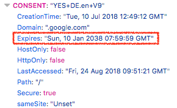
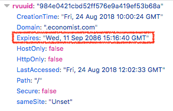
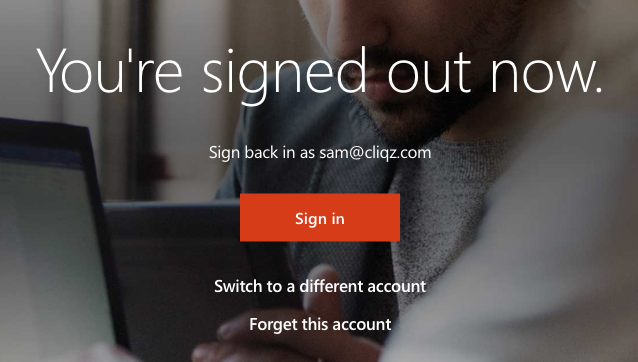
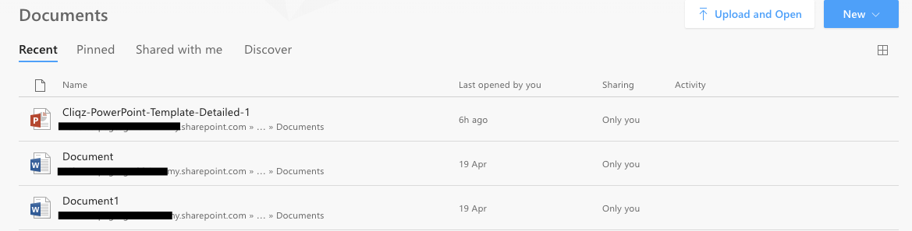
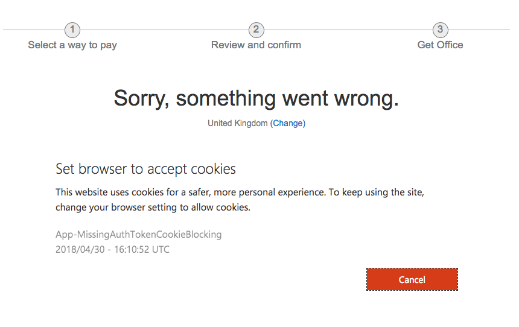
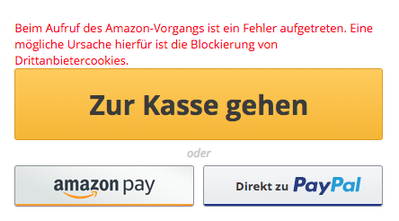
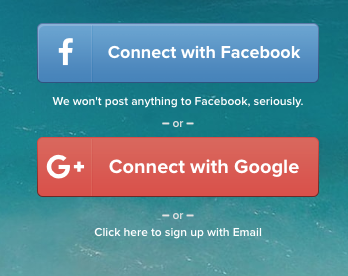
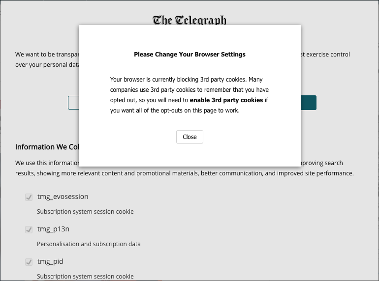

title: Third-party cookies - the guests who won't leave
subtitle: How the web ecosystem is preventing us from reverting the third-party cookie mistake.
author: privacy team
type: primer
publish: True
date: 2018-08-27
tags: blog, cookies
header_img: blog/blog-third-party-cookies.jpg
+++

Summary: _In this post we describe_

 * _How third-party cookies are the cause of multiple privacy and security issues on the web._
 * _That, despite the cookie spec writers recommending against it, all major browsers ended up allowing third-party cookies by default._
 * _How several major sites and services, including those from Microsoft and Google, fail badly when third-party cookies are blocked._
 * _How Cliqz and Ghostery are defusing the privacy issues of third-party cookies by blocking them, while preventing the breakage issues caused by developers assuming a cookie free-for-all._

---

Cookies are a fundamental browser technology which enables state to be kept between browser and servers over the normally stateless HTTP protocol. Cookies enable sites to remember your login, what you've put in your shopping cart, and allow a site to remember language or currency preferences.

These features enable the sites you're visiting, 'first parties', to improve your experience and provide some content behind authentication, only accessible to you. However, browsers also, by default, send cookies to any third-parties embedded by the site operators. In some cases these can be used to allow third-party widgets, such as [Disqus](../trackers/disqus.html) comments, to automatically log you in to embedded content in the page. However, it also enables these third-parties to track your browsing across the web.

Allowing cookies to third-parties opens up a privacy hole in your browser. On [many sites](../websites.html), just visiting a page will set cookies for over 50 different third-party domains. Each of these are setting cookies so they can [correlate requests](./how_facebook_knows_exactly_what_turns_you_on.html) coming from your browser over days, months, or even years. For example, when you visit any page with a Facebook widget (or visit Facebook itself), they will set a cookie which will only expire in 2 years time. Some google.com cookies expire in 20 years. The `facebook.com` and `google.com` domains are present as a third-party to [24%](../trackers/facebook.html) and [30%](../google.html) of page loads
on the web respectively, allowing these services to tracker this proportion of the average user's web browsing history.


<div class="row">
  <div class="col-md-6 col-xs-12">
    
  </div>
  <div class="col-md-6 col-xs-12">
    
  </div>
</div>
<p class="img-caption">Google's consent cookie lasts for 20 years; A tracking cookie on the Economist which lasts for 68 years.</p>

Third-party cookies also represent a security risk to you. [Cross-site request forgery](https://en.wikipedia.org/wiki/Cross-site_request_forgery) (CSRF) attacks are based on the idea that I can make a third-party request to a site that the browser has previously authenticated with, and the browser will send the credentials with the request. If browsers did not allow third-party cookies these attacks would be much harder to exploit than they currently are. These kinds of attacks have been around for over 15 years, and methods to mitigate them are [still being proposed](https://blog.mozilla.org/security/2018/04/24/same-site-cookies-in-firefox-60/), while
browser-side protection, such as [first-party isolation](https://wiki.mozilla.org/Security/FirstPartyIsolation), have very limited distribution.

Furthermore, the use-cases which legitimately use third-party cookies, like Single-Sign-On portals, or third-party authentication mechanisms, have alternatives which do not require cookies. Sites using a centralised authentication domain can obtain authenication tokens via first-party redirects, and OAuth[^2] can be used to log in to sites using third-party credentials. These mechanisms have the added bonus of transparency and implied consent: When a user logs in with Facebook on a site, the user is actively allowing this connection between the site and Facebook to proceed.

So why do we have third-party cookies? Actually, the original 1997 [RFC Specification](https://tools.ietf.org/html/rfc2109) of the cookie standard proposed that third-party cookies should not be allowed on privacy grounds:

> This restriction prevents a malicious service author from using unverifiable transactions to induce a user agent to start or continue a session with a server in a different domain. The starting or continuation of such sessions could be contrary to the privacy expectations of the user, and could also be a security problem.

and browsers should have this setting by default:

> User agents may offer configurable options that allow the user agent, or any autonomous programs that the user agent executes, to ignore the above rule, so long as these override options default to "off".

However, these recommendations were not implemented by browser developers at that time, and the default of _'allow all cookies'_ has remained since then.

Currently, almost all major browsers have a default to allow all cookies. The one exception is Safari, which only allows third-party cookies for domains which have been visited as a first party. This setting mitigates tracking from unknown domains, but still allows others to track, and does not prevent CSRF attacks. Mozilla also previously [attempted](https://blog.mozilla.org/netpolicy/2013/02/25/firefox-getting-smarter-about-third-party-cookies/) to change Firefox's default handling of third-party cookies in 2013, but pressure from the Ad industry led to a [U-turn](https://blog.mozilla.org/blog/2013/05/10/personalization-with-respect/) before these changes went live. The failure of browsers to handle third-party cookie tracking [has argueably led](https://medium.com/the-graph/how-to-reverse-publisher-revenue-drain-c33e41bf0665) to the increase in adblocker usage since then.

The effect that this default has had over the last 20 years, is that developers now assume that cookies are allowed in all contexts. This causes many workflows to break once this assumption is broken. This leads to a vicious cycle, where attempts to limit third-party cookies are foiled because they break too many sites. Apple's push to reduce third-party cookie tracking with their [Intelligent Tracking Prevention](https://webkit.org/blog/7675/intelligent-tracking-prevention/) technology had to include a section to explain to developers how to solve several use-cases when their cookies are limited. This technology still allows third-party cookies from visited sites however, and this method is also recommended for implementing single sign-ons.

## Moving away from third-party cookies

In 2015 Cliqz[^1] released an anti-tracking technology which [aggressively blocks third-party cookies](./how_cliqz_antitracking_protects_users.html). Third-party cookies are blocked unless certain heuristics are triggered. These heuristics aim to mitigate common cases where cookie blocking breaks workflows, but also require user action to trigger. A Facebook button can be loaded without cookies, but if the user then clicks on it, there is an implied consent to allow the cookies in this case. This method blocks 97% of third-party cookies, with minimal breakage of pages.

<table class="table table-hover">
  <thead>
    <tr>
      <th>Browser</th>
      <th>Default Cookie setting</th>
    </tr>
  </thead>
  <tbody>
    <tr>
      <td>Google Chrome</td>
      <td>Allow all.</td>
    </tr>
    <tr>
      <td>Mozilla Firefox</td>
      <td>Allow all.</td>
    </tr>
    <tr>
      <td>Apple Safari</td>
      <td>Allow from visited; tracking cookies limited.</td>
    </tr>
    <tr>
      <td>Cliqz Browser / Ghostery extension</td>
      <td>Block all third-party, unless user interaction or compatibility exception.</td>
    </tr>
  </tbody>
</table>

In December 2017, this technology was included in the [Ghostery 8 release](https://www.ghostery.com/blog/product-releases/browse-smarter-with-ghostery-8/). This increased the number of users with this aggressive cookie blocking behaviour and this increased exposure also highlighted more cases where cookie blocking causes problems for websites. In many cases it may not be surprising that developers have not considered or tested the possibility of third-party cookies not being allowed. What surprised us though, is that this is so pervasive that the biggest players fail to handle cookies properly, in some cases causing critical bugs.

At present, if you browse the web with third-party cookies disabled, you may come across issues logging in and making payments. Here we outline several cases we have found involving major tech companies (which should be able to solve this issues), which have consequences from just preventing login or completing payment, to potentially leaking private company data from a Microsoft Office account.

### Microsoft Logout Issues

We found that, when all third-party cookies are disabled, logging out on office.com seems to succeed, but actually fails. Additionally this authenication remains available when subequently navigating to office.com, which can be used to extract data from the SharePoint API. This issue was submitted to Microsoft but was rejected on the grounds that it is not remotely exploitable. It is however a risk on any shared computer that a subsequent user would be able to see document metadata for the organisation, and perhaps modify data via the SharePoint API.

This can be simply reproduced by disabling third-party cookies in any browser, then logging in and then out again on office.com.


<p class="img-caption">Looks like I'm logged out...</p>

After the confirmation of a successful logout, simply navigate back to www.office.com, and one is returned to the view after login, including an up-to-date feed of recently changed documents.


<p class="img-caption">Document change feed still shown after logout.</p>

The API that makes this information available after logout is fetched via the [SharePoint REST API](https://docs.microsoft.com/en-us/sharepoint/dev/sp-add-ins/sharepoint-net-server-csom-jsom-and-rest-api-index), and the authentication token for this is not deleted nor expired after the failed logout - hence the page can continue to access this information. The token can be collected from the developer tools and then reused for API calls, for example to list folders in this organisation's SharePoint:

```javascript
var accessToken = "eyJ0...";
var baseUrl = 'https://org-my.sharepoint.com/_api/';
var headers = new Headers();
headers.append('Authorization', `Bearer ${accessToken}`);
headers.append('Accept', 'application/json;odata=verbose');
fetch(`${baseUrl}web/lists`, { headers })
    .then(resp => resp.json())
    .then(res => console.log(res))
```

The broken logout state can only be resolved by manually deleting office.com cookies. We also found the session may eventually be expired, but this only happened after multiple hours. Hence, users affected by this will 1) likely not be aware that they're not logged out properly, as the logout appears to be successful, and 2) would not be able to logout anyway if they noticed the issue.

The issues with Office continue when trying to purchase an Office365 trial from `https://products.office.com/try`. This time, the source of the problem is detected, but the user is given no choice to continue unless they compromise their security and privacy by enabling cookies. Ironically, they also imply that allowing third-party cookies is somehow safer.


<p class="img-caption">It is not possible to buy Office without allowing third-party cookies.</p>

### Pay with your Cookies

It is common practice for E-Commerce sites to embed payment systems from third-party vendors, such as Paypal, on their checkout pages. Such widgets should not require third-party cookies - usually the user can be redirected to pay at the payment provider's site. This method is preferable, as it reduces the chances of phishing: loading the payment page as a first party will make the url and certificate status visible, and only prompting users to enter payment information on the first party site is also good practice.

Despite this, we see examples of payment being blocked when third-party cookies are disabled. One such example is on the German E-Commerce site [Thomann.de](../websites/thomann.de.html). When attempting to checkout with Amazon pay, we get an error mentioning that third-party cookies are being blocked:


<p class="img-caption">"There was an error processing the Amazon payment. A possible cause is third-party cookie blocking."</p>

### Connect with Google? Third-party cookies required

Many sites use Google's connect SDK, to allow users to login to sites with their Google account. When testing cases on [www.tripadvisor.com](https://www.tripadvisor.com) and [www.stumbleupon.com](https://www.stumbleupon.com) with third-party cookies disabled, the 'Connect with Google' button fails to do anything when clicked. Both these sites also offer Facebook login too which works with cookies disabled. It is not clear why the Google implementation requires third-party cookies to be allowed.

 
 <p class="img-caption">Tripadvisor signup buttons. </p>

### Please let me track your tracking opt-out

Following GDPR, websites using third-party services which collect data about users [acquire consent](./update_jun_2018.html) for this, as well as provide a reasonable way of opting-out of data collection and processing. While many publishers have converged on a solution which [gathers consent as a first-party cookie](https://iabtechlab.com/standards/gdpr-transparency-and-consent-framework/) which can then be passed to third-parties, other still rely on an older system of setting opt-out cookies for each vendor. Obviously, if third-party cookies are blocked, this mechanism will not work, as can be seen on the [Telegraph](../websites/telegraph.co.uk.html):


<p class="img-caption">"You browser is currently blocking 3rd party cookies ... you will need to enabled 3rd party cookies if you want all of the opt-outs on this page to work."</p>

In this case, users with third-party cookies disabled will be denied their right to opt-out (though blocking these cookies will effectively prevent a large proportion of tracking).

Third-party vendors may say that this mechanism is required in order to remember a user's consent settings. However, previous attempts to allow browsers to convey tracking consent explicitly to servers, via the ['Do Not Track'](https://www.w3.org/TR/tracking-dnt/) standard were killed by the same vendors collectively saying they would [ignore this signal](https://blogs.harvard.edu/doc/2015/09/23/how-adtech-not-ad-blocking-breaks-the-social-contract/).

## Conclusion

When the idea of cookies was first proposed, the standard writers were concerned about the privacy implications of allow third-party cookies, and specified that browser vendors should disable them by default. Fast-forward 20 years and the majority of browsers on the web will allow all third-party cookies. The result of this are significant challenges to protect against Cross-site request forgery, with countless sites and accounts compromised along the way, and pervasive privacy invasion in the form of cross-site tracking of users.

We argue that we should aim to return to a web where third-party cookies are blocked by default, and are making that possible for users of our anti-tracking technology in [Cliqz](https://cliqz.com/) and [Ghostery](https://www.ghostery.com/), however this is made difficult by the prevailing assumption that cookies are a free-for-all, making many sites fail to function properly in this environment. In this regard we are constantly improving heuristics to mitigate the breakage issues we do find.

We showed multiple cases where the assumption that third-party cookies will be allowed lead to both benign and potentially dangerous issues for users who block cookies. Some of these cases affect payments, so perhaps if cookie-blocking becomes more common and companies' bottom lines are effected these issues will be fixed. This is a chicken and egg problem though, if the web is broken for users blocking cookies, then we may never achieve the critical mass required to get it fixed.

**For users**, getting control over which cookies your browser sends out, and to whom, is a key part of protecting privacy online, but also something that is not universally recognised by
browser privacy tools. Most adblockers, for example, do nothing to the cookies of third-party requests which are not on their blocklists. More adoption of the kind of cookie blocking that Cliqz and Ghostery do help us to achive this critical mass, and push more websites to ensure that their services still work correctly for users who chose more private browser configurations.

**Developers** have a part to play here too. By building services which do not require third-party cookies, or at least continue to function without them, it becomes easier for users to turn off third-party cookies, and the web becomes more privacy-friendly. As we have seen in this article, even the biggest tech companies are currently failing at this, but this seems to be more due to a lack of awareness, than any difficultly in implementation.

[^1]: Disclosure: WhoTracks.Me is operated by Cliqz.
[^2]: Note that both of these methods also have some privacy issues. First-party redirection has been exploited for [user tracking](https://brave.com/redirection-based-tracking/), and OAuth dialogs can trick users into granting [many more permissions](https://lifehacker.com/how-to-revoke-pokemon-go-s-extensive-permissions-to-you-1783466118) than they actually need.
