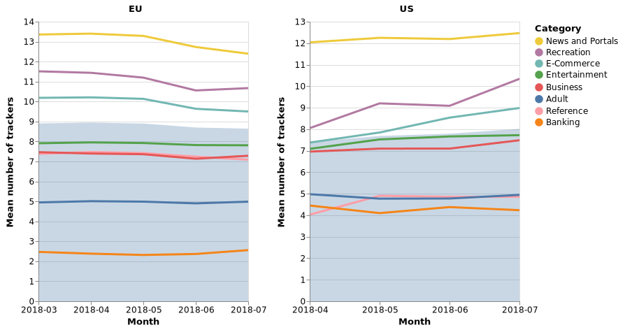
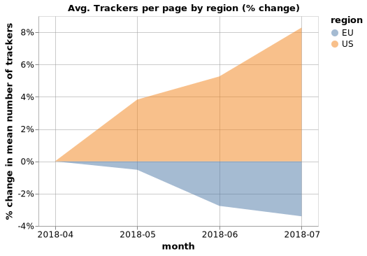
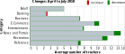
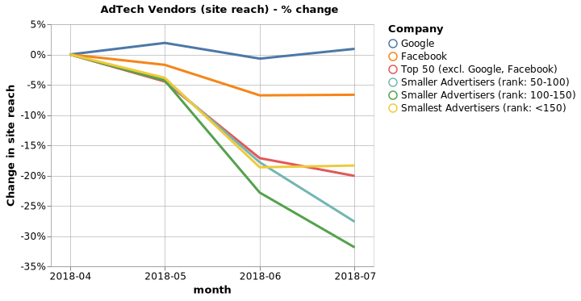

title: GDPR - What happened?
subtitle: The tracking landscape post GDPR, adverse effects on competition and a market for compliance technologies
author: privacy team
type: article
publish: True
date: 2018-09-03
tags: blog, gdpr
header_img: blog/gdpr/gdpr-header.png
+++

_In this article we look at the effect GDPR has had on the tracking landscape,  
online advertising in Europe, and provide a set of recommendations for machine 
readable legislation._

## GDPR: A primer

Having been a hot topic of discussion for at least the last 2 months,
it is unlikely that GDPR needs an introduction. So in brief:
the regulation applies to the processing of personal data of European
citizens. Companies engaged in such processing activities
are subject to compliance, regardless of whether or not they operate in the
EU[^1].  An important aspect of the regulation is the pressure
put on companies to obtain consent from their European users for the
processing of their personal data. This is why prior to May 25th,
2018 there was a surge in emails in your inbox, and it's also the
reason for the numerous popups you see when visiting websites.

GDPR was announced two years before it came into force, and
it was not the overhaul of privacy legislation one could believe it was from
reading the press. In fact, GDPR came as a major update of the previous
EU Data Protection Directive[^2] which has been around since 1995. Designed 
to harmonize the data protection legislation in the EU, 
and catch up with technological progress in the last 23 years, GDPR
comes heavily loaded with legal language that many have found hard
to navigate. Daphne Keller of the Standford Center for Internet and Society said
"*The final GDPR text is riddled with ambiguous passages*", suggesting
that the ones who will benefit the most from GDPR are data protection
lawyers[^3].

**So, what happened?** This is the question we are all left with.
We will be using whotracks.me data to make sense of the effect of
GDPR on the tracking landscape in the web and on online advertising,
the behemoth of third party services on the web.

## Tracking Landscape on Websites

We take 2000 [websites](../websites.html) profiled on **whotracks.me**
and compare the tracking landscape in these sites as a function of the
origin of the users visiting. We want to compare the EU, subject of GDPR,
with the US.

Merely looking at the average number of trackers per page for each
category of site being visited reveals a general downward trend
in Europe. The opposite is true in the US. The blue area indicates
the average number of trackers across categories.

In fact, if we look closely, since April 2018 the average number of
trackers per page in the EU has dropped by almost 4% while in
the US it has increased by 8%.

 If we take the top 2000 domains visited by European residents, and
 check how the average number of trackers per page by the category
 of the website, we notice that there as been a reduction in the
 number of third parties almost across the board.

The reduction seems more prevalent among categories of sites with a
lot of trackers. We see a 7.5% reduction in the average number of
third parties per page from April to July in News websites. This is in
the same direction as what was identified by a study published last
month by the University of Oxford. They looked at news websites,
and found that the number of cookies set on page decreased
on average by 22%[^4].

Some websites, like [The Los Angeles Times](../websites/latimes.com.html), interrupted
their operations in Europe, others decided to offer text only versions
of their websites if the user does not consent to sharing data with third
parties, like [npr.org](../websites/npr.org.html). What we are certainly
observing is a rise in the usage of consent management tools, for which
we [wrote about in more detail](./update_jun_2018.html) back in June.

## Third party services: the winner takes it all

Both the most lucrative, and the most pervasive of all services performed
by third parties is online advertising - the 'fuel' that keeps a large part
of the web running.

Online advertising in 2018 is estimated to be a $270 billion[^5]
market, and expected to grow by more than 20% in the next two years.
This is the market that third parties are competing for, and when
the prize is so high, worries over GDPR having regressive effects
on competition are understandable. As in most markets, the presence
of monopolies is something regulators try hard to avoid[^6]. The question
is then: ***Has GDPR, designed to enhance user privacy in the web,
had any adverse effects on competition?***

At present, whotracks.me has profiles for more than 1000 trackers, out of which
about **200** are classified as advertising services. For each of these
trackers we have data on what percentage of the measured web traffic we
have observed the tracker to be loaded - `reach`[^12], as well as what
percentage of websites the tracker is present on - `site_reach`[^13].
Monitoring `reach` and `site_reach` gives us interesting insights into the 
structure of the market these trackers operate in, as well as their relative market share. 
Using whotracks.me data, we can do that at scale. Each month we have on average
about 300 million page loads and more than half a million websites.

If we rank each tracker by its reach, and measure changes in reach since April,
we notice that in Europe, most advertisers appear less. 

The same trend persists when we look at `site_reach`.

Google's advertising services have maintained their market share, while
other advertisers across the board have lost reach. There could be several
reasons to explain Google's favorable state post GDPR:

1. **Resources thrown at compliance**: Google and other big companies have had
significant resources dedicated to compliance[^7].

2. Google acts in the capacity of a gatekeeper, hence it is
conceivable to assume it may have used that position in punitive ways. Reports
indicate that Google could have encouraged publishers to reduce the number of AdTech
vendors[^8].

3. Websites owners trying to minimize their exposure opt for 'safer choices',
dropping smaller advertisers that may have a harder time proving compliance.

Using a tracker's reach as a proxy for market share, we measure that GDPR
may have had regressive effects on competition in the online advertising
space in Europe.

## Recommendations for GDPR 2.0
GDPR has had a measurable impact on advancing the rights of European
citizens on the web. We believe one of the most important contributions
of GDPR is the increased transparency on how personal data is moved around,
as well as the management of consent from the user, and think GDPR 2.0
should strive to be **machine-readable** as opposed to **human-readable**.

GDPR came as an update to the EU Data Protection Directive, primarily because the
evolution of the web in the last 20 years rendered the old regulation obsolete.
**Human Readable** is not the way to design a law that aims in large part to regulate
interaction in the web. The design of the tools meant to empower
users are left to the service providers, whose incentives don't exactly align
with that of the users. This can give rise to deceptive interfaces and UX patters,
designed to exploit human cognitive biases.

What we need, is a GDPR 2.0 that pushes for *machine readable* standards,
giving rise to user-focused solutions, simple, non-deceiving interfaces, thus
creating an industry of privacy and compliance, where technologists
keep other technologists in check.

Here are our recommendations:

1. **`/privacy-policy.txt`** - require websites to host the privacy policy
in a standard location of the sitemap. At present, identifying the location
of the privacy policy of a website is not as straightforward as one
may hope. Last year as part of the Mozilla Global Sprint we built
[Privacy Bot](https://github.com/cliqz-oss/privacy-bot), which aimed to
gather, persist and analyze privacy policies. One of the challenging
problems we had to solve, was identifying where the privacy policy was hosted.

2. **`/third-parties.json`** - provide a structured list of third parties
present on the site, the service being performed by them, list of data points
they have access to (e.g. IP, user agent, pages visited on site ... ), and
default state of consent. This would enable browsers to assume the role they should
have had baked in: a unified control center for the user to
manage consent. This is especially important given the rise of deceiving UX patterns
we are increasingly used to seeing in websites these days[^9].There are 
standards that can be built upon, like the Content Security Policy, and the
Do Not Track Standards, which are widely adopted by browser vendors.
A similar effort is `/ads.txt`, initiated by the iab techlab, aiming towards
a mechanism to define authorized sellers for web content from the perspective
of the domain owner[^10].

3. **`/dpo.json`** - increase oversight of the Data Protection Officer,
detaching the role further away from the organization. Provide machine
parsable details of the DPO, for users to be able to reach out more easily,
as well as providing incentives for the establishment of a new market
around privacy management.

4. **`/incidents-and-cases.json`** - Data Incidents reported have increased
as a consequence of GDPR[^11]. This information should also be made available
to the public. The web is currently built and operated largely on trust. As such,
transparency over the amount of incidents a given website or service has had
to report is very important. Furthermore, provide a list of the open
court cases involving the mismanagement of personal data the company
is involved in.

## Conclusions
In Europe, GDPR has thus far had a measurable impact in reducing the average
number of trackers websites put in their pages, while in the US the opposite is
true. The increase in transparency benefits users as they enjoy an increased
control over their data, but the UX of the services managing that consent
does not always have users' best interest in mind.

On the other hand, in Europe GDPR has led the online advertising market to become more
concentrated, as the majority of advertisers lose market share. If this trend persists,
it is possible that GDPR is having adverse effects on competition. For users this
means that while the number of third parties asking for access to their
data is decreasing, a tiny few are getting more of their data.

To Regulators, and especially the supervising authorities responsible
for the enactment of GDPR, we think you should strive for creating incentives
for industry players to keep each other in check, thereby creating a market for
privacy. The only way this can be achieved is by pushing for a machine readable
legislation that enforces standards.

#### Footnotes

[^1]: GDPR Article 3 on [Territorial Scope](https://gdpr-info.eu/art-3-gdpr/)
[^2]: EU Data Protection Directive [[source]](https://en.wikipedia.org/wiki/Data_Protection_Directive)
[^3]: GDPR is vague [Standford Center for Internet and Society](http://cyberlaw.stanford.edu/blog/2015/12/final-draft-europes-right-be-forgotten-law)
[^4]: News Websites post GDPR [[Factsheet]](https://reutersinstitute.politics.ox.ac.uk/our-research/changes-third-party-content-european-news-websites-after-gdpr)
[^5]: Digital Advertising Market [[Statista]](https://www.statista.com/statistics/237974/online-advertising-spending-worldwide/)
[^6]: Google's Anti-trust cases in Europe [[source]](https://www.reuters.com/article/us-eu-google-antitrust-timeline/googles-antitrust-cases-in-europe-idUSKBN1K81CC)
[^7]: Preparation for GDPR [[source]](https://www.theguardian.com/technology/2018/may/25/facebook-google-gdpr-complaints-eu-consumer-rights)
[^8]: Google's Funding Choices [[source]](https://adexchanger.com/online-advertising/googles-gdpr-consent-tool-will-limit-publishers-to-12-ad-tech-vendors/)
[^9]: Dark Patterns: How UX design tricks you into giving away your privacy [[source]](https://cliqz.com/en/magazine/dark-patterns-how-ux-design-tricks-you-into-giving-away-your-privacy)
[^10]: IAB Techlab `ads.txt` [[source]](https://iabtechlab.com/wp-content/uploads/2017/09/IABOpenRTB_Ads.txt_Public_Spec_V1-0-1.pdf)
[^11]: Reported Data Incidents increase with GDPR [[source]](https://www.itgovernance.co.uk/blog/ico-statistics-show-increase-in-reported-incidents-ahead-of-gdpr/)
[^12]:`reach`: Proportional presence across all page loads (i.e. if a tracker is present on 50 out of 1000 page loads, the reach would be 0.05). Value is a float between 0 and 1.
[^13]:`site_reach`: Presence across unique first party sites. e.g. if a tracker is present on 10 sites, and we have 100 different sites in the database, the site reach is 0.1. Value is a float between 0 and 1.
