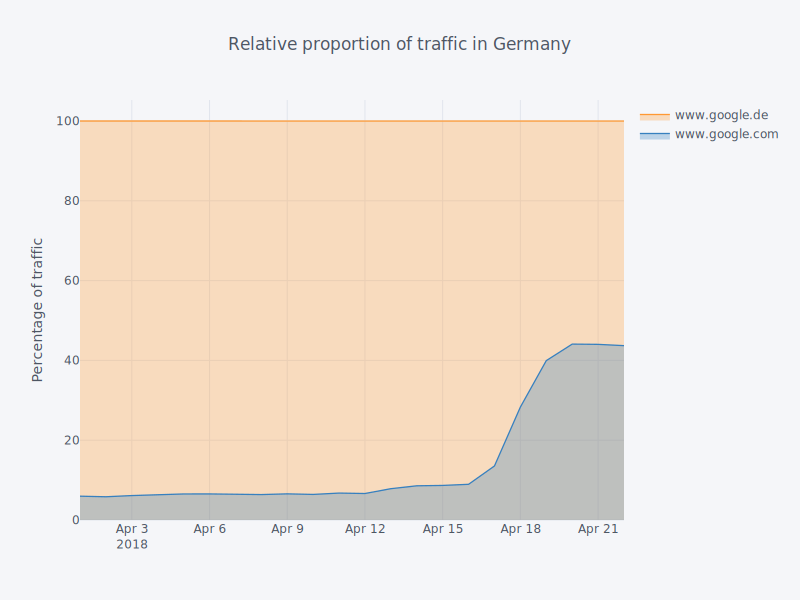

title: The end of google.{your country}?
subtitle: Google's move to keep their cookies.
author: privacy team
type: article
publish: True
date: 2018-04-23
tags: google, cookies, tracking protection
header_img: blog/google_domains/dataflow.png
+++

There have been [recent reports](https://twitter.com/vtoubiana/status/987365270187634688) that
Google has started redirecting users from regional variants of Google search (served on
google.{de, fr, co.uk, etc}) to google.com for search results. This has implications for the
[4th most prevalent](../trackers/google.html) tracker on the web, so we decided to check
the data to see what is going on.

By looking at WhoTracks.Me data from April, we see that around April 16th there is a shift in
traffic from Google's European search results pages (`www.google.{de,fr,at,co.uk,etc}`) towards
`www.google.com`. The figure below shows that the former domains all saw a 50% drop in number
of page loads over the last week, while `www.google.com` is up 100-150%, suggesting Google
are doing a gradual rollout of this change. These changes lie well outside the bounds of
the weekly traffic fluctuations we usually see.

Percentage change in traffic to google search result pages, April 2018

We can further see the magnitude of this change by focusing on data for Germany. If we look at the
relative proportion of pages loaded on `www.google.de` and `www.google.com` in Germany over the last
month, we see a marked increase, with the share of traffic to `www.google.com` going up from around
5% to over 40%.

Search results pages used in Germany, April 2018

Why is Google doing this? We don't know - we're not aware of any official announcement. However,
one reason for this could be a reaction to increased usage of restrictive cookie settings, such
as allowing cookies only from visited sites, or Apple's [Intelligent Tracking Prevention](https://webkit.org/blog/7675/intelligent-tracking-prevention/).
If a user is rarely visiting the google.com domain, these technologies can expire this cookie earlier,
or prevent its use in third-party contexts.
As `google.com` is the domain used to authenticate with Google services, if the browser sends
`google.com` cookies in third-party context, these visits can be directly attributed to one's
Google profile. Therefore, this change increases the likelihood that the user will have recently
visited `www.google.com`, and therefore Google's tracking can continue uninterrupted.

Tracking from `google.*` domains [reaches 30% of web traffic](https://whotracks.me/trackers/google.html),
and the majority of this reach is contributed by the [`google.com` domain](https://github.com/ghostery/whotracks.me/blob/master/whotracksme/data/assets/2018-03/global/domains.csv#L5).
As, with this change, it is very difficult to avoid visiting `google.com` domain as a first party,
preventing this tracking in a vanilla browser would require disabling all third-party cookies.
Alternatively, [Cliqz](https://cliqz.com/) and [Ghostery's](https://www.ghostery.com/) AI anti-tracking
technologies block all third-party tracking cookies (Disclosure: the author works on this product).
[Privacy Badger](https://www.eff.org/privacybadger) is also able to block third-party tracking cookies.
