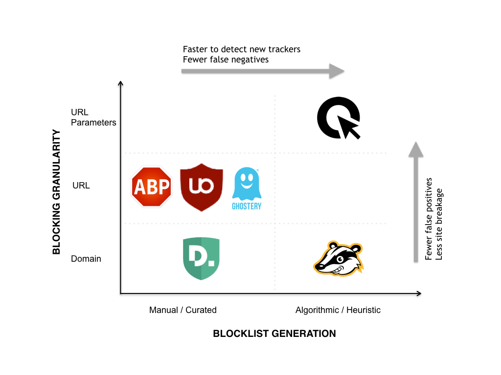

title: How Cliqz anti-tracking protects users
subtitle: Using an algorithmic, data-driven approach to remove unique identifiers that track users.
author: privacy team
type: article
publish: True
date: 2017-07-22
tags: privacy, circle
header_img: blog/blog-anti-tracking.jpg
+++


There are already many tools available which aim to prevent the kinds of tracking we have described. In general these act as browser extensions which monitor network traffic and intervene when tracking is detected, i.e. blocking UIDs in transmission. These can be categorised into two groups:

1. Blocklist-based: These tools use curated blocklists in order to block third parties seen to be tracking. This predominately targets advertising trackers as an extension or side-effect to Adblocking features. Examples include Ghostery, Disconnect, Firefox tracking protection, and uBlock Origin.
2. Heuristic/algorithm-based: These tools use heuristic and/or algorithmic analysis to determine when to block or modify requests. Examples include Privacy Badger and Cliqz’s own anti-tracking system.

Blocklist-based methods have several shortcomings. Firstly, blocking requests is very coarse grained and can easily break site functionality. Overly broad blocking rules may block many requests which are of no privacy risk. On the other side, exceptions made to prevent site breakage may then allow some privacy leaks, for example the Facebook like button is still allowed when using the [EasyPrivacy](https://easylist-downloads.adblockplus.org/easyprivacy.txt) blocking list, and there are [many other](https://easylist-downloads.adblockplus.org/exceptionrules.txt) such exceptions.




Secondly, as these lists are manually maintained, they will always be playing catchup against trackers. Tracking companies can constantly change their URLs, domains and methods to prevent blocking, and those generating the lists must respond in each case.

Finally, blocking lists bestow significant power to their curators. With blocking browser extensions being used ever more ([over 40% of users](https://downloads.pagefair.com/wp-content/uploads/2016/05/Adblocking-Goes-Mainstream.pdf) for some market segments), those who write the block list would have the power to cut off a significant proportion of a company’s traffic — deservedly or not.

Heuristic approaches like Privacy Badger are limited by just having local knowledge. In many cases we will not know if data sent is unique to us until we have tested it in another browser and seen a different value, like in the fingerprinting example in the previous post. Thus some kind of collaboration is required between users to determine what data is safe, and what is not – and this is the method Cliqz’s anti-tracking uses.


# Cliqz Anti-tracking
As we outlined in the previous section, blocklists have several drawbacks, and we did not want such an aggressive system. Likewise, relying purely local evaluation of whether data is a UID or not has significant limitations. Therefore, we designed a system which combines local with global evaluation of tracking data. It is also designed to be conservative — we only remove data which we determine to be UIDs, and leave the rest alone. Our system modifies request URLs instead of blocking. This aims to reduce site breakage, and enable services to collect data, provided it does not compromise the user’s privacy.

Like existing tools we focus on removing UIDs in transmission, rather than trying to prevent UID generation. Therefore we have three transmission vectors: HTTP Headers, URL Path and Post data. The latter we currently do not handle as our data shows that the reach of this method is very low, however our system allows us to continually monitor the situation, should this change.

The Cliqz anti-tracking system is split into two subsystems. One that handles only Cookies, and the other which handles all other data sent in headers and the URL path.


## Cookie Protection
Protecting from tracking cookies is relatively simple. This is because the vast majority of third-party cookies have no function beyond tracking. Therefore we can very simply strip these from the request without breaking the page.

However, blanket third-party cookie blocking is not an ideal solution, because some third-party widgets do require cookies, to, for instance, authenticate with their service. In order to enable this use case, our system allows cookies in cases when user interaction with the widget is detected. When this happens, the third party is temporarily whitelisted to allow cookies.

This implementation effectively prevents all cookie tracking, and rarely breaks the user-experience on web pages. This is despite the fact that over 96% of third-party cookies are removed.


## Unsafe Data Removal
The second anti-tracking subsystem deals with the non-trivial problem of identifying whether the data sent in a request is ‘safe’ or not. By this we mean, that the data point could be used as a UID, i.e. it is unique to the user. Once we identify what data is unsafe we remove it from the request before it is sent by the browser. This means that if a tracker tries to aggregate their data using this UID, then all Cliqz users will appear as one, and thus will gain crowd anonymity. The algorithm therefore runs as follows:

When a page is loaded, for each third-party request:

1. Analyse the URL, headers and postdata of the request.
2. Tokenise this data into key-value pairs.
3. Evaluate the safeness of each key-value pair.
4. If there are unsafe values, remove the data from the request.

How can we determine what data is safe or not? A UID is characterised as a value which is unique to a single user, and which is repeatedly seen by this user. Such values can be detected by aggregating the data seen by multiple users over a period of browsing time. However, by the time this aggregation would tell us what the UIDs were, it would be too late — the trackers would already have the data. Therefore, our algorithm does the inverse: Detecting the values which cannot be UIDs, and removing all other data.

The advantage of this method is that the protection for new users is available straight away. New UIDs will not be known by the system, and therefore be removed by default. Furthermore, the set of safe values is significantly smaller than the set of unsafe. Safe values will be categorical in nature, and therefore be only ever be `O(1)` in size, while the set of UIDs will be `O(n)`, where n is the number of users.

We can also classify many values as safe locally, without having to consult the global safe value set. Our system uses the following rules for local classification:

- If a value has not been seen previously for the `(third party, key)` pair, it is safe.
- If a value is too short, i.e. has too little entropy to be a UID, it is _safe_.
- If more than 3 different values have been seen for a `(third party, key)` pair over a two day period, then the value is not persistant, and therefore safe.

If none of these rules are able to classify the value as safe, we use the global safe set, which tells us which values have achieved a quorum of users who all saw the same value.


### Example

Consider a hypothetical visit to the site `example.com`, which has tracker.de as a third party. After processing a request we generate a set of `T = [(s, d, k, v)]` tuples as follows:

```javascript
T = [
    (s= example.com, d= tracker.de, k= z,  v= 1459866821),
    (s= example.com, d= tracker.de, k= fl, v= 21.0),
    (s= example.com, d= tracker.de, k= u,  v= CCAAAABI),
    (s= example.com, d= tracker.de, k= vr, v= 1440x1024),
    (s= example.com, d= tracker.de, k= c7, v= e9d4a7e4d2185cec),
]
```

We can then evaluate these values:

- `(s= example.com, d= tracker.de, k= z, v= 1459866821)`: This was the first time we saw the value `1459866821` for the given `(d, k)`, so this data is _safe_.
- `(s= example.com, d= tracker.de, k= fl, v= 21.0)`: The value `21.0` is too short to be a UID, so it is _safe_.
- `(s= example.com, d= tracker.de, k= u, v= CCAAAABI)`: More than 3 different values seen in the last two days for the same `(d, k)`, so _safe_.
- `(s= example.com, d= tracker.de, k= vr, v= 1440x1024)`: Always the same value seen for this `(d, k)` pair, however the value is in the global safe set (as it represents a common screen resolution), therefore _safe_.
- `(s= example.com, d= tracker.de, k= c7, v= e9d4a7e4d2185cec)`: Always the same value seen, and not in the globally safe set, so this value is _unsafe_ and will be removed.


### Building the Global Safe Set
We build the global safe set daily using the data sent from users’ clients. Clients collect the tuples of data from each request while browsing and send this back to us every hour, adding a timestamp parameter. The values in the tuple are hashed to prevent user-identifiable information being sent to us. The client guarantees that a maximum of one message is sent per user per hour, so this can be used instead of a user id to count the number of users for each (third party, value) tuple. If the number of users exceeds the quorum threshold for a given hour, it is added to the safe set.

This model allows users to create this collaborative safe value set without compromising their privacy. Any privacy sensitive information in the data is obfuscated by the hash function, and, as no UID is required for our aggregation, we cannot derive any browsing history beyond the single hour granularity (there is no way to link messages from different hours), and the most information that could be gained is the first-party domain names visited. This protection is further strengthened by the use of our [Human Web](https://events.linuxfoundation.org/sites/events/files/slides/collecting-user-data-socially-responsibly.pdf) technology which further obfuscates the source of each message we receive.


# Cliqz vs Other Anti-tracking Systems
The algorithmic, data-driven system for removing UIDs from third-party requests which we have described has several advantages over other anti-tracking solutions. As an online system we can respond much quicker, and without human oversight, to changes in trackers and their techniques. If a tracking company switched domains to try and avoid blocklists, we would have the data to block this tracking within a day. Human-curated blocklists would take comparatively longer to update.

In our [paper](https://static.cliqz.com/wp-content/uploads/2016/07/Cliqz-Studie-Tracking-the-Trackers.pdf) we did several tests to measure the difference between our system and other blocklist systems. Our tests indicated a reduction in breakage on web pages caused by our system, compared to adblockers. We also saw that blocklist-based systems blocked more often, but a large proportion of these blocks were false positives: requests which did not contain any UIDs.

The downside of our method is that, unlike other blockers, we see a net performance loss when loading complex web sites. This is because, other blocking systems simply block the javascript which will then attempt to calculate and send a fingerprint, while we will block just the outgoing request with UID. Thus blockers get a performance benefit of avoiding running this resource-heavy tracking javascript code.

However, we believe that in the long term, this property is a net benefit. Unlike other anti-tracking systems, Cliqz can forgive. If a tracker updates its code, and switches to a method which no [longer sends UIDs](http://www.slideshare.net/jmpujol/data-collection-without-privacy-sideeffects-at-big2016-www-2016), then our system will immediately stop blocking their data. With blocklists, there is no such mechanism — trackers are then incentivised to circumvent the block (for example using a new domain name), rather than improving their data collection methods.


# Summary
Our anti-tracking system has now been running successfully for over a year, blocking around 300 million cookies and removing around 10 million UIDs per day to keep our users free from tracking. The same system, as described here, is now also available on [our mobile browsers](https://cliqz.com/en/mobile) to provide the same protection across even more devices, and give users control over what data third-parties can collect about them.
