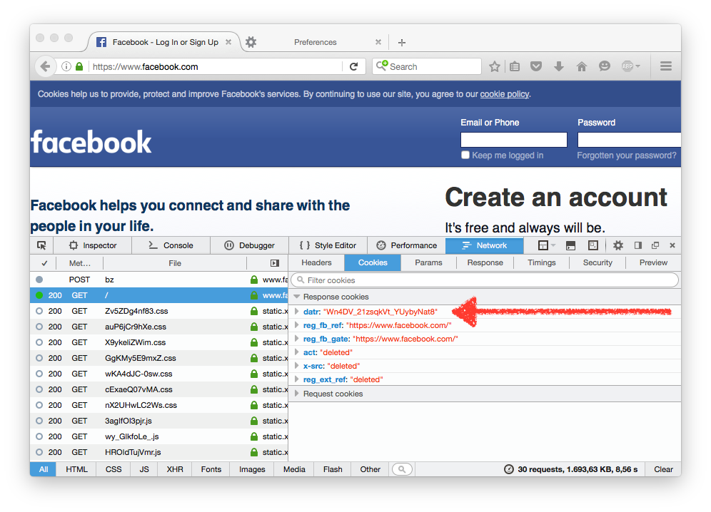
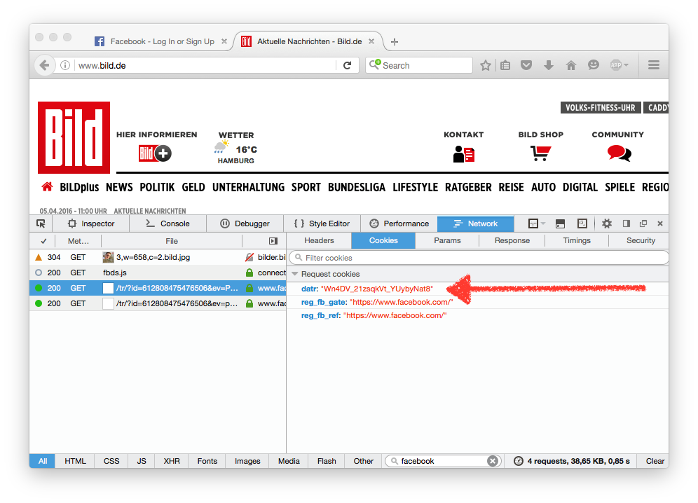
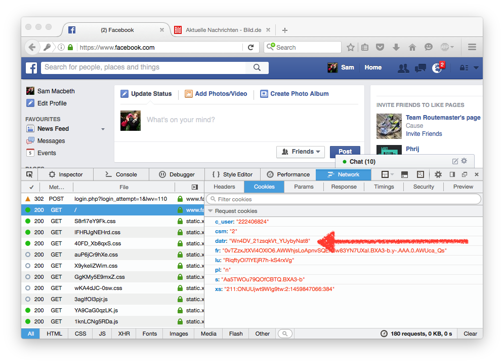
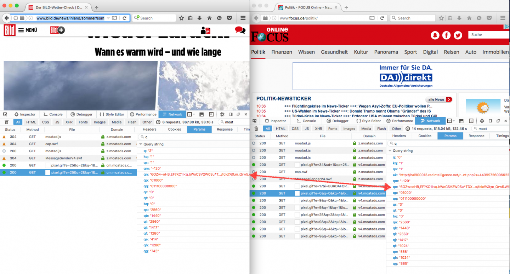
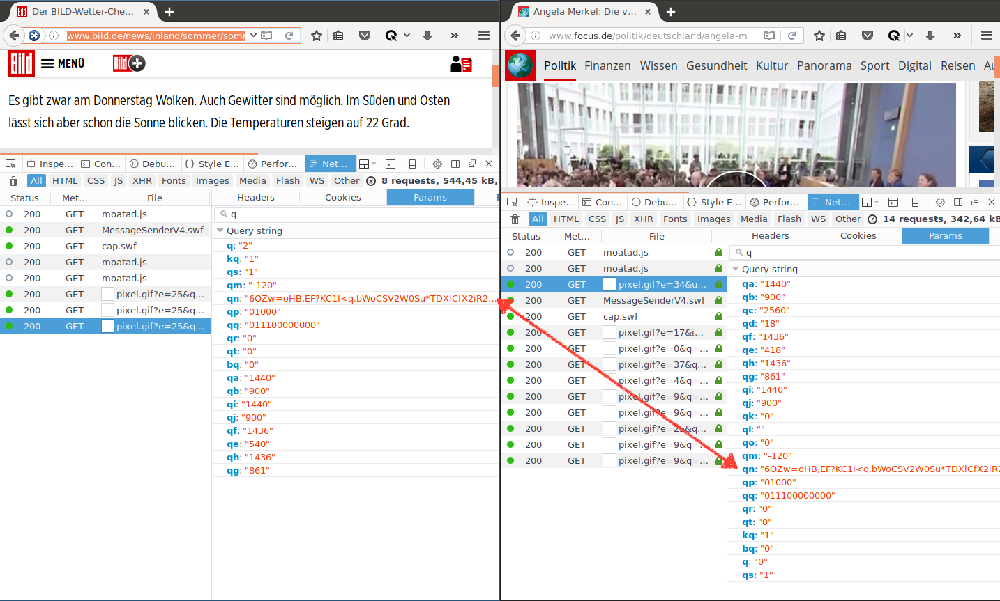
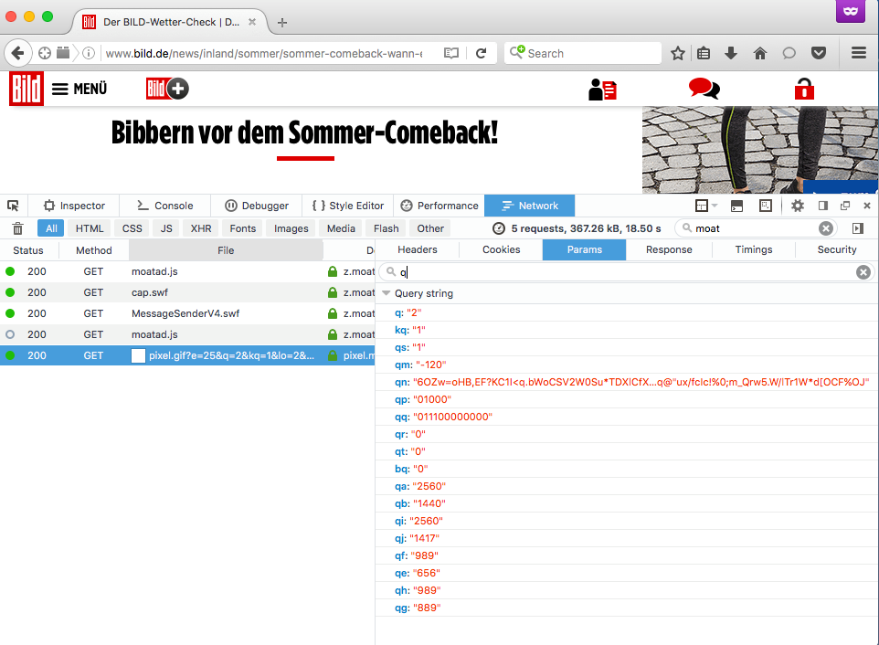
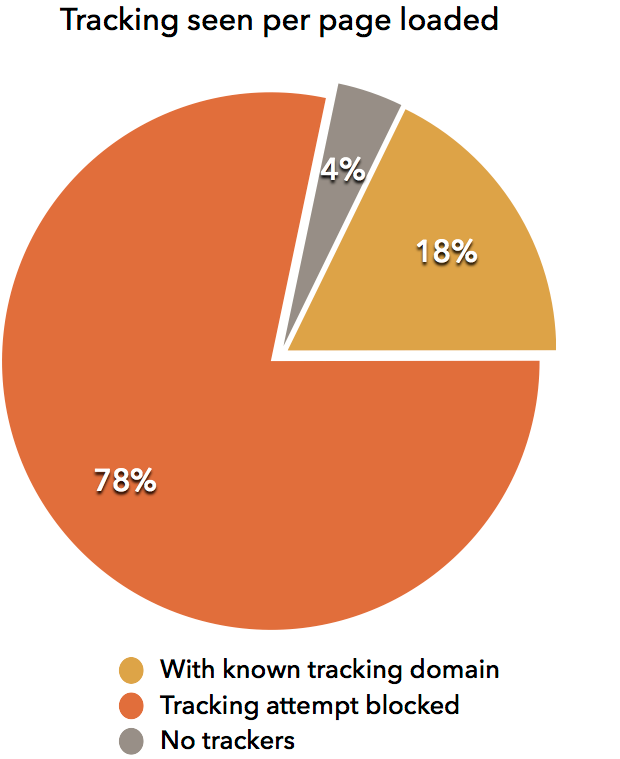
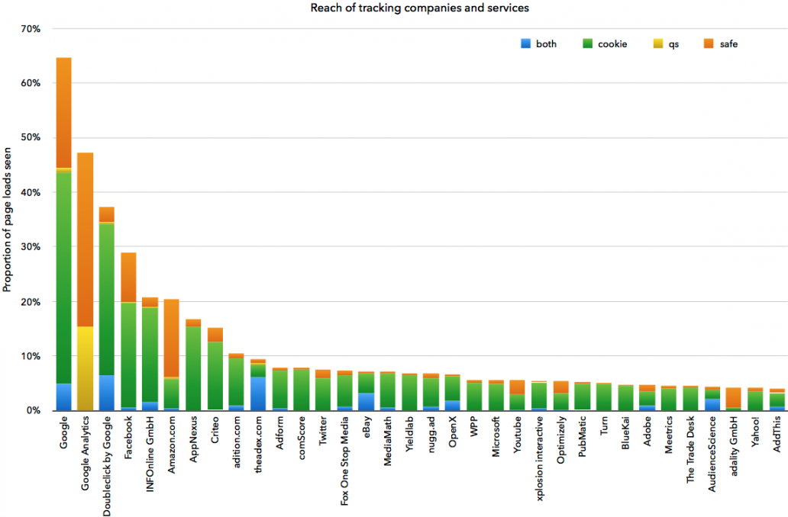
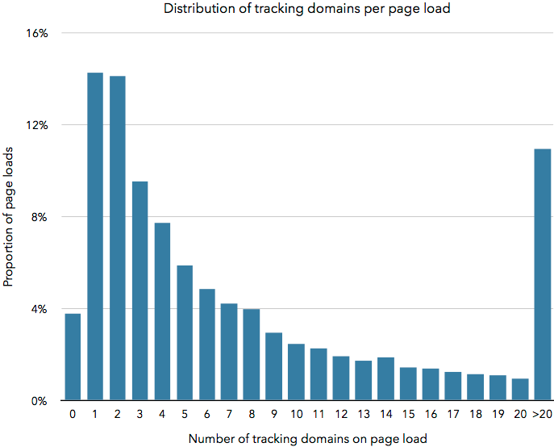

title: How facebook knows exactly what turns you on
subtitle: A technical analysis of the methods used to track users as a third party. Deep dive into a couple of case studies.
author: privacy team
type: article
publish: True
date: 2017-07-22
tags: privacy, circle
header_img: blog/blog-facebook.jpg
+++

The modern web is built around advertising. A multi-billion dollar industry ([$42bn in 2013 in the US](http://www.iab.net/about_the_iab/recent_press_releases/press_release_archive/press_release/pr-041014) and about [6bn in 2015](https://de.statista.com/statistik/daten/studie/456157/umfrage/umsaetze-im-markt-fuer-digitale-werbung-in-deutschland/) in Germany) primarily concerned with one question: How to make the most money by serving exactly the right ad, at the right time, to the right user.

Web pages are extremely complicated constructions, often meshing together multiple software tools and services from different providers, from analytics and social sharing widgets, to dynamic advertising and content recommendation engines. Consider an average news site with social media sharing buttons. More often than not, these are created by linking to scripts from Facebook, Google, Twitter, etc., which then inject the required content into the page. These third parties may then in turn load other required services into the page.

In isolation, this seems mainly harmless. Services are being provided to the website owners to better integrate third-party services such as social networks, add extra widgets such as comment sections and related content, and improve the website’s monetisation through targeted advertising.

However, the implementation of these services often cause a privacy side-effect: they allow third-parties to track your web-browsing across the web, and in some cases even link this history to you personally. When a user visits a new site the third parties included in the page can then look up the browsing history they have collected for this user, and then generate a personalised response based on this information. This is akin to being given a personalised newspaper where the adverts have been selected based on which articles you have read previously, in both this and other newspapers, any magazine articles you might have read, where you shop and what items you were looking for, [where you bank](http://cliqz.com/magazine/pressemitteilung-cliqz-tracking-beim-online-banking) and more. Our data shows that largest of these tracking third party services can be seen on [almost half of all pages you might visit](http://josepmpujol.net/public/papers/pujolTrackingTheTrackers.pdf), and many others share and [trade user data](https://big.exchange/) amongst each other in order to build a comprehensive user browsing history.

Luckily, as the web is an open system, we can see what these companies are up to, and equip the browser with the capability of foiling their attempts to send tracking data.

This post is the first part of a two-part series. In the second part we will describe how our Anti-tracking system works. This part acts as a background to that, describing the how and why behind online tracking. The methodology and data we present here is based on our [published work](http://josepmpujol.net/public/papers/pujolTrackingTheTrackers.pdf) on Anti-tracking, which we [presented](http://www.slideshare.net/jmpujol/tracking-the-trackers-www-2016) at WWW2016.

## How online tracking works

The mechanism behind online user tracking is simple enough. First, one must be a third party to many page loads across the web. Our data shows that almost 30% of web sites require 10 or more different service providers to fully load their content, and dynamic advertising alone can bring this many different companies into the page. Secondly, the request a third party receives when loaded into a page should contain some kind of user identifier (uid) for the client visiting the page, as well as the address of the first party page visited (usually provided by the Referer [sic] header). Collecting together the first-party pages seen for each uid will then yield the browsing histories of all the users seen.

A simple list of visited web pages may not seem like a significant privacy violation to some, however further analysis can yield much more information than one might expect. Trackers can collect users’ browser and operating system, which can be used for [price discrimination](http://news.northeastern.edu/2014/10/ecommerce-study/), and rough geographical location can be checked using [IP geolocation](https://en.wikipedia.org/wiki/Geolocation). One can also find private urls in the history to determine membership of certain services, such as some [online banking portals](https://static.cliqz.com/wp-content/uploads/2016/07/Cliqz-study-tracking-in-online-banking.pdf) which contain trackers. Another example is the twitter analytics dashboard (e.g. analytics.twitter.com/user/sammacbeth/home). This url is only accessible when logged in as a specific user, and when accessed the browser will transmit this user name in the url to the trackers in this page (in testing, these included Google, Microsoft and tellapart.com), thus enabling these services to add a user’s twitter handle to the previously collecting browsing history. Private urls, such as this, are particularly dangerous, because they often contain Personal Identifiable Information (PII) which puts a real identify on the other urls that are being collected in that session (See [http://www.slideshare.net/jmpujol/data-collection-without-privacy-sideeffects-at-big2016-www-2016](http://www.slideshare.net/jmpujol/data-collection-without-privacy-sideeffects-at-big2016-www-2016) for an example.).

### UID Generation Techniques

The uid that trackers need in order to attribute page loads to specific users can be generated in several different ways:

1. Cookies – This is the simplest and most common method for generating uids. Cookies are a web standard for sharing state between a client and server over the stateless HTTP protocol. It is an important part of the web, which enables sites to keep track of your login and/or preferences between visits. Cookies work as follows: When a client makes a request to a server, in the response the server can set a header Set-Cookie with a value of its choosing. The client will, from then on, send this value in headers for any subsequent requests for this domain, and thus the server will know which user it was who sent the request.

2.  Network fingerprint – This method uses the properties of the network from which the request comes from as an identifier, usually the IP address. This varies in effectiveness based on whether users have unique IPs or not.

3. Client fingerprint – Here, code is run in the client browser to try and build a unique identifier from data accessed in Javascript, Flash and other APIs, for example installed fonts, browser plugin versions, screen resolution, browser version and more. Techniques such as canvas fingerprinting are further able to fingerprint the specific hardware configuration of the user’s computer. Together this can generate a unique fingerprint which is stateless, and endures even when private data is cleared, and private tabs are used.

Once generated, these uids must be transmitted to the tracker with information about the page the user is visiting. Again there are three primary methods:

1. HTTP Headers – This is metadata send along with a request with information for the server. This is where Cookies are transmitted, but also other data can be sent here. Our data shows that 45% of requests to third parties on web pages seen by our users contain a cookie header.

2. URL Path – Arbitrary data can be sent in the URL path requested from the server. This is commonly in the form of a query or parameter string — key/value pairs separated by & or ; characters at the end of the query. 52% of third party requests have some kind of query string, and 1.5% a parameter string.

3. Post data – This is data sent from the client as part of the main body of the request. We see this kind of request in 0.05% of cases.

### Case Study 1: Facebook cookie tracking
Facebook use cookies to link your web-browsing behaviour to your Facebook account. Facebook widgets are embedded in various sites around the web, and will send the address of the page you are viewing along with your Facebook cookie, enabling Facebook to build a list of sites you have visited. Our data shows that Facebook’s widget reaches 25% of pages loaded by our users – this means that Facebook could collect 25% of an average user’s browsing history.

We can see this tracking in action by inspecting requests in the web browser. First, if we visit the Facebook home page, we can see a cookie called datr being set:

Now, upon visiting a site which has a Facebook widget, in this case bild.de, we can see a request to facebook.com. As third-party cookies are enabled in the browser (the default setting in all major browsers), we will send the cookie we got on the previous page along with the request. The Referer header of this request will also contain the site I am visiting: www.bild.de.

As I continue to browse the web, this process will repeat, and Facebook will collect a series of requests with this datr cookie and the pages I was viewing.

Finally, if I now log into my Facebook account, we see that the datr cookie remains, and now alongside a cookie with my Facebook user ID. This means that Facebook can now attribute all the pages I have viewed with my personal Facebook account.

This mechanism allows Facebook to collect your browsing habits across the web, in order to tailor adverts and recommendations within their site. [Our measurements](http://josepmpujol.net/public/papers/pujolTrackingTheTrackers.pdf) show that this tracking covers around 25% of pages visited by our users.

Facebook were banned last year from using this tracking on European users who had not logged into their site, however this was recently [overturned](http://www.theverge.com/2016/6/30/12069626/facebook-belgian-privacy-commission-cookie-user-tracking-case-overturned), so this practice continues.

### Case Study 2: Moatads fingerprinting
[Moat](https://moat.com/) is an analytics and advertising provider. They are present on many popular news sites, where their JavaScript is loaded into the page, and then a tracking pixel is sent back to their servers. We can observe this behaviour by opening two different sites in our web browser and inspecting the requests to moatads.com:

Here we can see many parameters are sent in the request, and many values match across both requests. However, we cannot know for sure if these represent uids, or just other values used legitimately for the service. However, the qn value is suspicious, as a long cryptic value which remains the same when visiting different sites.

We now try opening the same sites in a different browser:

Again, pixels are generated with various parameters set in the request URL. Some are the same as we saw in the first test, for example the qq parameter. However, looking at the qn value we see that it is again the same on both web pages, but different to the value we saw on Mac. We can hypothesise that this is a fingerprint of this browser which functions as a uid, however we would need more examples from more unique browsers to properly test this.

Finally, we test the qn in a private tab in the first browser. As shown below, we see that the same fingerprint is generated. Therefore, Moat are able to also tag page views in private tabs with the same uid as in a normal window, suggesting that they can bypass this protection for their tracking purposes.

# Where are the trackers
These two case studies have shown the technical means with which companies can collect the pages you visit, and group them by a particular user, be that against a specific facebook profile or just a hash value which uniquely identifies one’s computer. Having established that third parties may snoop on some pages you visit on the web (with the first party’s permission), the question is how far does this tracking reach, and how much of our browsing habits can these third parties collect?

We presented our data on the [online tracking](http://josepmpujol.net/public/papers/pujolTrackingTheTrackers.pdf) seen by 200,000 users over a two week period at the [WWW2016](http://www2016.ca/) conference in April, which analysed over 13 million page loads by our users. A large study of 1 million sites has also been done by researchers at Princeton with similar findings to ours, although the study is not based on real user traffic but rather on data collected by instrumented browsers that download and scan for trackers top sites on the Web. We present some updated results from our on-going browser telemetry, during August 2016, and containing over 140 million page loads over 1.8 million unique domains. Multiple visits to the same site and/or page are counted multiple times, thus the data set weighs more popular pages more strongly, and represents the tracking observed by an average user of our browser.

The first result we observe from our data, is that a small collection of third parties are are installed in a huge number of visited pages. From a list of 2000 domains, representing the top tracking domains, we see that 96% of page loads include a request to a third party in this list. Over 80% of these page loads (and 78% of the total) contain some kind of tracking attempt. Thus, a user browsing the web with no tracking protection could be tracked on 78% of the pages they visit.

We can further look at how much of an average user’s browsing history each third-party company might be able to tracking. We analyse the ‘reach’ – the proportion of total page loads in the data set seen – by domains associated with particular companies or products. The figure below shows the top companies in terms of total reach, and for each we indicate the types of behaviour seen on each page. ‘Safe’ means that no tracking behaviour was seen, just that a request was made to the domain; ‘cookie’ and ‘qs’ mean that there was an attempt to transmit a uid with one of these methods, and ‘both’ means that both methods were used.

The figures show that the big players – and particularly Google, with their products taking the top three places – have significant reach across the web. Some specific company behaviours can also be observed, for example Google Analytics does not use cookies, using a weaker kind of fingerprint. Also, Amazon, offer CDN services on their cloudfront.net and amazonaws.com domains, thus a high proportion of their reach is safe.

The other feature of the tracking landscape is the long tail of tracking companies. There are 27 companies/services with over 5% reach, 110 with over 1%, then 450 over 0.1%. This 0.1% still corresponds to over 140,000 pages seen on this data set.

Finally, we can look at how many trackers are seen on each page load. The figure below shows how many distinct tracking domains were contacted for page loads in the dataset. We see that over 10% of pages have over 20 different trackers in them, and the vast majority of page loads have multiple trackers. Therefore, not only are users tracked across most of the web, after there are many companies who are able to generate comprehensive user profiles.

# Conclusion
In this post we’ve given a general description of how online tracking works, and looked at the extent of tracker companies’ reach across the web. In the next post we will look at how we can stop this tracking, and give an in depth description of how our Cliqz Anti-tracking technology works to prevent tracking without an adverse effect on user experience.
