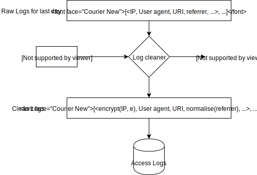

title: Tracking visits without tracking people
subtitle: A privacy-by-design approach.
author: privacy team
type: article
publish: True
date: 2018-05-03
tags: analytics, privacy-by-design
header_img: blog/analytics/analytics.png
redirect_url: https://www.ghostery.com/blog/private-analytics
+++

Analytics are one of the most common use-cases on the web. You want to know how many people are
visiting your website, whether anyone actually clicked the link you posted on social media, or who
is sending traffic to your website. For most sites, the solution is to just drop a
[Google Analytics](../trackers/google_analytics.html) script into the page - it's free, after all...
This has led us to the current situation, where we see Google Analytics having presence across 87%
of the top half a million websites, and, despite using reasonably short-lived identifiers, the way the data is collected can be used to
[track users across these sites](https://www.slideshare.net/jmpujol/data-collection-without-privacy-sideeffects-at-big2016-www-2016#13).

Is counting page visits such a difficult problem that only Google has solved it? No, there are
[paid](https://get.gaug.es/) and [open source](https://matomo.org/) alternatives available, but
why pay when you can use a free version which does more, and why host a server with the extra
costs that entails, when you don't have to?

But is Google Analytics actually better than the competition? We would argue that, at least among
privacy conscious users (i.e. those
[who contribute to the WhoTracks.Me dataset](../blog/where_is_the_data_from.html)), Google
Analytics will report vastly incorrect figures, for two main reasons:

1. Our data shows that on 29% of pages with Google Analytics some of the requests will be blocked
due to Ghostery blocking settings.
2. On 19% of pages with Google Analytics, Cliqz and Ghostery's AI anti-tracking will remove
potential identifiers from the request, often causing unique visitors and conversions to be
incorrectly measured.

## Analytics without tracking

So how can we _accurately_ measure the traffic coming to our site without exposing the user to
tracking and privacy side-effects? This was a problem we faced when we created the WhoTracks.Me
website. We wanted to have _some_ analytics so that we can measure if we are being successful in
engaging people with the information we are providing on the site. However, we had a few
constraints:

1. No tracking. We [define tracking](../blog/what_is_a_tracker.html) as when a service is able to
collect and correlate data across multiple sites. Unfortunately, as server-side aggregation is the
norm amongst third-party analytics providers, privacy cannot be guaranteed.
[Client side alternatives](http://josepmpujol.net/public/papers/big_green_tracker.pdf) have been
proposed, but unfortunately [the implementation](https://github.com/cliqz-oss/green-analytics) only
reached a proof-of-concept state. This means we have to roll our own service.
2. Minimal Ops. WhoTracks.Me is a statically generated site, which is simply hosted on a CDN. This
decision was made to minimise costs, make it fast, and eliminate the need to deploy and monitor
hosting infrastructure. Having done this, it does not make sense to have to deploy infrastructure
in order to host a [Matomo](https://matomo.org/) or similar service.
3. Respect Privacy. The system should not store any personal information from users (i.e. IP
address), nor be able to correlate visits for an individual user over a long time frame. Apart from
the obvious reasons for this, it makes regulatory compliance easy: If we do not hold IP addresses,
it is not possible for us to extract data on an individual user for data access or deletion
requests (as per GDPR).

Our analytics implementation satisfies these three constraints, using probably the oldest technique
on the Internet: server log parsing. Daily analytics for the WhoTracks.Me site are generated as
follows:

1. Visits to the site are logged via [CloudFront's logging mechanism](https://docs.aws.amazon.com/AmazonCloudFront/latest/DeveloperGuide/AccessLogs.html).
2. Each day, a script processes these logs, to obfuscate personal data such as IP addresses. This
script generates a random key for the day, and encrypts all IP addresses with this key. The
anonymised logs are copied to a new bucket, and the key is destroyed once the job completes. This
method allows us to count unique visits from an IP address during a single day, but no day-to-day
correlations can be made, nor can the IP address ever be recovered from the anonymised value.
3. The original CloudFront logs (with IP addresses) are removed.
4. We can then parse the clean logs and filter out requests to static resources and those by bots
in order to see requests to actual pages. We can count unique visitors within single days, using a
combination of user-agent and anonymised IP; we can see where incoming traffic is coming from via
HTTP referrers (which we also strip of potentially revealing parameters) and so on.

Processing of raw CloudFront logs to remove potential personal data.

This workflow allows us to keep track of how much traffic we are getting to the WhoTracks.Me
website. There is also no reason that this method could not be scaled up to more complex use-cases
which services like Google Analytics provides, like conversion counting - provided the time frame
that this conversions can occur in are shorter than the time the IP encryption key is used for.

The method is also safe with respect to privacy regulations and user preferences. As IPs are stored
for maximum 1 day (and this is only because CloudFront's logging does not obfuscate IPs for us), no
other personal information is collected, and message linkage limited to 1 day, there are no
additional obligations regarding the usage of this data under GDPR. Furthermore, as tracking is time
limited and context limited (this data can only be used for usage on whotracks.me), it respects
[Do Not Track](https://en.wikipedia.org/wiki/Do_Not_Track) automatically (using the standard's own
[tracking definition](https://www.w3.org/TR/tracking-dnt/#terminology.activity)).

## Conclusion

We rolled our own analytics for this site because there was no off-the-shelf solution providing the
(very basic) analytics we wanted without significant extra overhead, or potential privacy
implications for users of the site. Our system leverages CloudFront logging with a data obfuscation
step in order to collect privacy-safe server logs which can then be analysed for basic insights.
This technique could be extended to provide most of the richer features of existing web analytics
tools.

The lack of privacy-preserving tools in the web analytics ecosystem is a worrying trend. Google
Analytics dominates as they provide an extremely feature-rich product as zero cost to the webmaster.
It is difficult to see how a service can compete with free without selling analytics data. Existing
competitors mostly aim for businesses who will pay for a premium product, and leave bloggers and
smaller sites to Google.

While increasing use of adblockers is a more fundamental threat to Google's Ad business, a side
effect may be a loss of trust in Google Analytics, as we measure
[29%](https://github.com/ghostery/whotracks.me/blob/master/whotracksme/data/assets/2018-03/global/trackers.csv#L2)
of pages with Google Analytics being affected by blocking. We already see companies which rely on
analytics for core business activities (for example advertisers using affiliate schemes) deploying
multiple analytics scripts and averaging the results. If the trust in analytics breaks down, then
this whole ecosystem may unravel.
