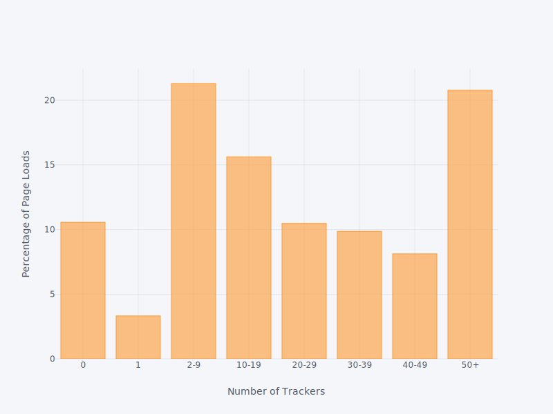
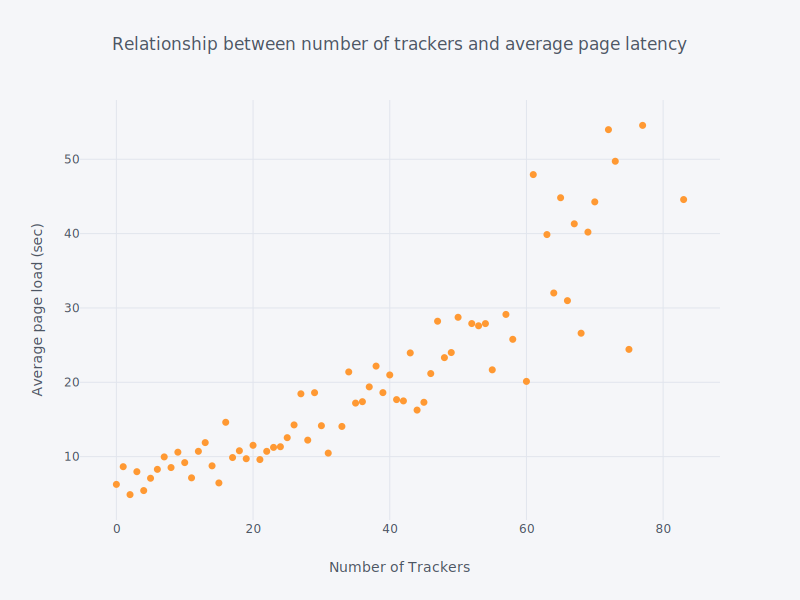
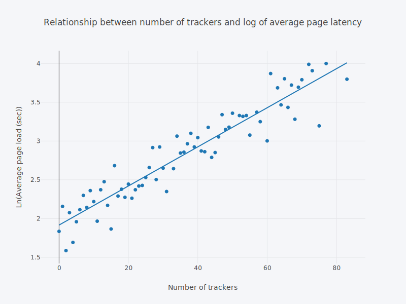
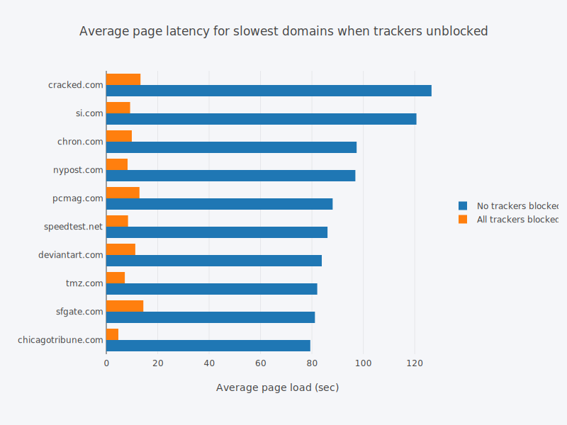

title: Tracker Tax
subtitle: The impact of third-party trackers on website speed in the United States.
author: privacy team
type: article
publish: True
date: 2018-05-29
tags: blog, update
header_img: blog/tracker_tax/tracker-tax.png
+++

_This post is a summary of the paper **"The Tracker Tax: the impact of third-party
trackers on website speed in the United States"**. Full paper can be found [here](https://www.ghostery.com/wp-content/themes/ghostery/images/campaigns/tracker-tax/Ghostery_Study_-_The_Tracker_Tax.pdf)_.
  

Earlier this month, we published a study titled, _“The Tracker Tax: the impact
of third-party trackers on website speed in the United States”_. The goal of
this study was to shed light on the impact of trackers from a performance
perspective, rather than the more frequently studied privacy standpoint.
Previous research on the topic has looked at the ubiquitous nature of online tracking
and their various business models[^1], pervasiveness of tracking, especially among
news websites[^2] and the privacy implication of tracking in the wild where a few companies
have extensive reach on web traffic [^3].

Beyond privacy concerns, we are left with one question: Do trackers cost us time?
More specifically, what is the relationship between the number of trackers and the time
a page takes to load? We call this tracker impact on the website page load times, also
referred to as page latency, the TRACKER TAX.

## Data Collection and Cleaning
Intuition tells us was that the more trackers present on a page, the longer it would take
that page to load; however, this hypothesis had not been tested on a large scale.
Web privacy measurement framework, [OpenWPM](https://github.com/citp/OpenWPM) has been
used by numerous researchers to collect data for privacy studies on a mass, automated
scale, but this tool was not built to measure website performance metrics like page load
time. So we built a custom crawler to collect the number of third-party trackers on a
website and the time it took that page to load.  The crawler was built with Selenium
running Chrome, making GET requests from a server based in New York City, and used
[Ghostery](https://ghostery.com) to collect two metrics per page load: the count of
third-party trackers and seconds to the load the page.

Ghostery detects third-party trackers by comparing a HTTP request with an instance in
their database, which currently contains over 3,000 tracker companies and 4,700 tracker
patterns. To measure the time it take a page to load, Ghostery uses
Mozilla’s `Window.performance` API [^4] by taking the delta between
`domContentLoadedEventStart` and `requestStart`. We chose to use Ghostery to measure
tracker count and page load time so the public could replicate similar, independent
analyses by simply installing the browser extension on their own and loading a
website to easily see these two metrics.

We ran the custom web crawler five times on each of the top 500 websites in the
United States, as determined by Alexa [^5]. Data cleaning included removing domains
with fewer than five successful measurements, and excluding four Chinese websites
from the sample.  We excluded these websites because we suspect there are China-based
trackers that are not yet accounted for in the Ghostery database. Further, to account
for variation in the data, we filtered out the fastest and slowest page loads per
site (and their associated tracker counts), so that the data would be less sensitive
to outliers and data collection errors. The crawler was run under two configurations:
1) with no trackers blocked, and 2) with the Ghostery browser extension
blocking all trackers. Both configurations underwent the same data cleaning process.

## Results
### Tracker Ecosystem
Using the data collected under the configuration without tracker blocking enabled,
we saw that nearly 90% of page loads contained at least one tracker, 65% had at
least 10 trackers, and 20% had 50 or more trackers.  Only 10% of page loads were
tracker free. These metrics once again confirm the prevalence of online tracking,
and broadly align with our
[previous study](https://www.ghostery.com/wp-content/themes/ghostery/images/campaigns/tracker-study/Ghostery_Study_-_Tracking_the_Trackers.pdf)[^6]
which observed that 77.4% of page loads contain trackers.

Figure 1: Distribution of the number of trackers

There are several differences between our two studies which may explain the increase
in tracker dominance seen in this study. Firstly, this study’s sample containing the
500 most popular websites in the US, while our previous study analyzed 144 million
page loads across more than 12 countries. By only considering the most popular websites
and neglecting the long tail of more obscure ones, it is not surprising that this study
saw a larger proportion of sites with a tracker. Additionally, the data for this study
was synthetically generated using a custom crawler, whereas our previous study used data
gathered from users of the Ghostery browser extension who had opted-in to the collection
of information about trackers on pages they visit. While the methodologies differ,
both studies verify tracker pervasiveness throughout the web.

### Trackers and Page Latency

Without blocking trackers, only 17% of all the pages in the study loaded within
5 seconds. All other pages loaded much more slowly: it took more than 10 seconds
to load nearly 60% of the pages, more than 30 seconds for 18% of the pages, and
nearly 5% of the pages took over a minute to load. This long tail cannot be ignored
and suggests Internet users waste a lot of time every day simply waiting
or websites to load.

Figure 2: Average time to load trackers

While we found that websites are generally slow to load, can any of this page
latency be explained by the number of third-party trackers on that site?
To answer this question, we calculated the average page load time for
each tracker count. We excluded both tracker volumes with fewer than
five observations and page latency outliers within each tracker
count (identified using the interquartile range rule).

To quantify the relationship between the number of trackers on a website and
the average time it took that page to load, we ran a simple linear regression
(`adj-R2 0.802`) which suggested that each additional tracker adds, on average,
0.5 seconds to the overall page load. The next model we fitted, which included
a quadratic term (`adj-R2 0.836`), suggests that trackers have an increasing
impact on page load times. However, these linear models both exhibit
heteroscedasticity – uneven variance of the error terms – and thus violate
linear regression assumptions.

Figure 3: Log Latency as a function of the number of trackers 

A Box-Cox test showed that log-transforming the response variable would realize
the best fitting model, and also act as a variance-stabilizing transformation.
The log-linear model (adj-R2 0.885) on the transformed data indicates a
compounding effect: if the tracker count increases by 1, we expect the
page load time to increase by 2.5%.

### Protection from Trackers
We also assessed the difference in page latency when trackers are blocked rather
than allowed. The data showed that the average page load time was twice as long
when trackers are not blocked: the mean page latency with no trackers blocked and
with all trackers blocked was 19.3 seconds and 8.6 seconds, respectively. These
time savings from blocking trackers are even more drastic when only considering the
10 slowest domains in the sample. We saw that average load times were 10x faster,
and blocking trackers saved an average of 84 seconds per page load.

Figure 4: Latencies for certain domains 

The term “piggybacking” describes the practice of one tracker that is placed
directly on a website giving access to other “piggybacking” trackers that are
not originally on the site.  We observed this phenomenon in our data: page loads
were not the only metric significant reduced when trackers were blocked, there
were also fewer trackers detected on the page. We saw significantly more
trackers per page when trackers were unblocked compared to blocked, in fact,
among the domains with the highest average volume of trackers, there were on
average 93 fewer trackers present per page load when tracker blocking was enabled.

Piggybacking can create a snowball effect, where trackers bring in more trackers
that can then bring in even more trackers; and as suggested above, each additional
tracker slows down a website more than previous ones. This not only has notable
performance implications, but also profound privacy concerns since these trackers
are not directly on the site, so site owners may not be aware such intrusion
is occurring.

## Future Implications

The data in our study clearly showed the pervasiveness of online tracking,
as nearly 90% of the most popular sites in the US had at least one third-party
tracker present. Our study also confirmed the strong, positive link between the
number of trackers on a page and the time it takes that page to load.  Generally,
the more tracks on a site, the longer the user will have to wait for that site to load.
Quantifying this relationship depends on the model used, however the optimal model
we found shows a compounding effect: for every extra tracker on the page,
the time it takes for the page to load increases by 2.5%.

While our current study focuses on only the most popular domains in the
United Sates, it would be valuable to apply this framework to other regions
to see if similar trends persist elsewhere. Additionally, future work may
include measuring additional performance implications of trackers including data
transferred.  This data transferred, which occurs when trackers make requests to
other servers, bears real monetary costs to the user, particularly on a mobile
device where data plans are typically based on data used. Expanding this study
to assess data transfer on mobile could be translated to the out of pocket
expense suffered by the user, in addition to the more subjective dollar value
of the user’s wasted time waiting for pages to load.

Other future work may also include looking at the relationship between
bounce rates and page load speeds, to calculate a hypothetical tracker
value measure.  Given the additional time trackers add to page loads, and
research suggest that slower pages lead to a loss in site traffic, one tracker
should provide the same value as this lost site traffic. As bounce rates
are likely influenced by other factors besides page load speed, like
funnel page and domain category, this potential future research involves
several additional considerations.

Moreover, the tracker tax may even have more pronounced implications
in the United States following the recent repeal of net neutrality.
In a time without such net neutrality regulations, users and their browsing
speeds may be squeezed from both sides – by the ISP and the online tracking
ecosystem. We may then start to see more of a two prong tacker tax: the
direct monetary impact imposed by the ISP and the more subjective dollar
value to the user for longer load times, and therefore more unproductive
time imposed by trackers.

In the wake of the net neutrality repeal, now more than ever users must
consider the performance implications of browsing online without
protection from trackers. The added waiting times incurred by not
blocking trackers are not trivial, especially as the population is
spending increasingly more time online. Luckily, various tracker blocking
tools are available so user can not only protect their privacy, but also
speed up their browsing experience by avoiding the tracker tax.

## References
[^1]: [Using Passive Measurements to Demystify Online Trackers](https://www.telematica.polito.it/users/mellia/papers/metwalleyComsi.pdf)
[^2]: [WhoTracks.Me: Monitoring the online tracking landscape at scale](https://arxiv.org/abs/1804.08959)
[^3]: [Tracking The Trackers](https://pdfs.semanticscholar.org/2bfb/b6b8da453f91f5860ea936588fddef6c80e0.pdf)
[^4]: [Windows.performance](https://developer.mozilla.org/en-US/docs/Web/API/Window/performance) API
[^5]: www.alexa.com
[^6]: Ghostery Study: [Tracking the Trackers](https://www.ghostery.com/wp-content/themes/ghostery/images/campaigns/tracker-study/Ghostery_Study_-_Tracking_the_Trackers.pdf)
