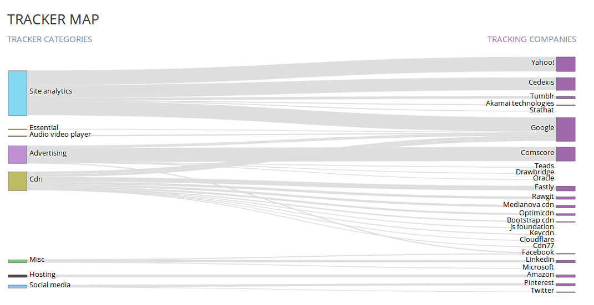
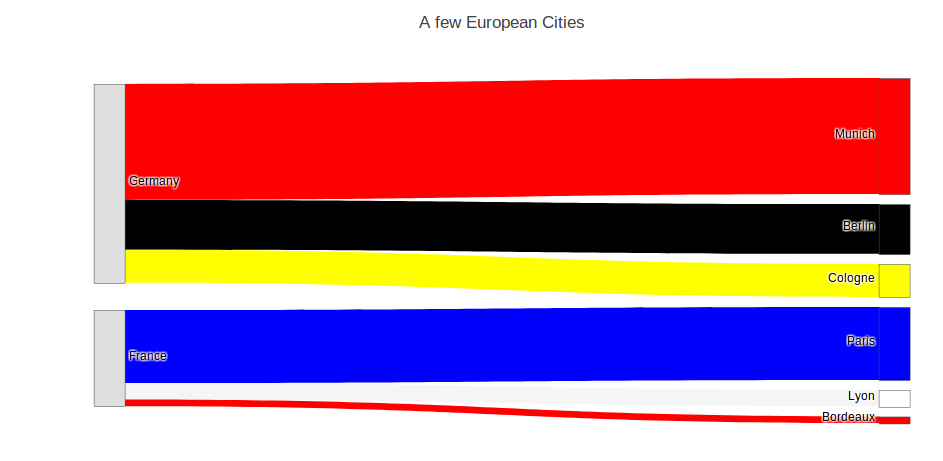
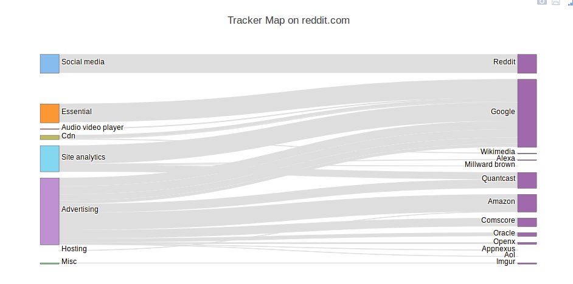

title: Making sense of the trackers on Reddit
subtitle: Using whotracks.me data and sankey diagrams to dissect trackers
author: privacy team
type: article
publish: True
date: 2018-01-08
tags: trackers, sankey
header_img: blog/trackers_on_site/blog-sankey-1.png
+++

In this post we'll try to do two things: show you how to use whotracks.me data
and API to investigate trackers on reddit, or any of your favorite sites, and teach 
you how to easily build sankey diagrams. We'll start with the second. 

## Sankey Diagrams 
When building the tracker maps that you see on popular site profiles on whotracks.me, 
sankey diagrams seemed like a good fit to map categories of tracking to companies t
hat own the trackers. Each link would be a tracker, going from a category to a company. 


<p class="img-caption">Figure 1: Sankey diagram used to represent a [tracker map](../websites/tumblr.com.html)</p>

Sankey diagrams are at visualizing flow volume metrics. Sometimes
they are found under the name alluvial diagrams, although they originally are 
different types of flow diagrams.

Given we had decided to use plottly.offline to generate the interactive images,
on the site, we wanted to use the sankey diagram supported in plotly, the vizualisation 
library of choice used in whotracks.me. The function itself is pretty simple, 
as you will see in a bit `sankey_diagram()`, but figuring out how the structure 
of the input data was not as straightforward. Hopefully the following example will 
make it easier for those reading this post, should they ever decided to try 
sankey diagrams.

The goal here is to show a very small dataset, structured in a way that the 
plotly diagram (and other plotting solutions e.g.: d3.js) understand. 
We will be mapping cities to the countries they are part of. The value of each link, 
will be the city population (in millions).

```python
city_data = dict(
        nodes = dict(
            label=["Germany", "Berlin", "Munich", "Cologne", "France",  "Paris", "Lyon",  "Bordeaux"],
            color=["beige",   "black",  "red",    "yellow",   "beige",  "blue",  "white", "red"]
        ),
        links = dict(
            source=[0, 0, 0, 4, 4, 4],
            target=[1, 2, 3, 5, 6, 7],
            value= [1.5, 3.5, 1, 2.2, 0.5, 0.2],
            label=["capital", "city", "city",   "capital", "city",  "city"],
            color=["black",   "red",  "yellow", "blue",    "whitesmoke", "red"]
        )
    )
```

Note how there are two keys in the dictionary, `nodes` and `links`, and each has some 
attributes. Let's go over them. Each node has a label (e.g. Germany) and a corresponding 
`color` (in this case `beige`). Note that labels and colors are stored in lists of 
equal length, and the pairing is done based on equality of that index.

Links contain information about how to link nodes. Each has a `source`, `target`, `value`, 
`label` and `color`. Source contains the index in the list of the source node, 
whereas target the index in the list of the target node. 
Value determines how thick the link should be (in our case it will be 
the population of each link, hence each city), Label and color, as the 
name suggests, specify the label and color of the link. Links too, are 
paired based on index.


## Plotting a sankey diagram

Now let's write a simple function to plot these data nicely. Most of the work has 
already been done, given we're feeding the data in a format that's easy to parse.

```python
from plotly.offline import iplot

def sankey_diagram(sndata, title):
    # First part of a plotly plot is the `trace`
    data_trace = dict(
        type='sankey',
        node=dict(
            pad=10,
            thickness=30,
            # label could easily be equal to sndatap['node]['label']. The following is just cosmetics
            label=list(map(lambda x: x.replace("_", " ").capitalize(), sndata['node']['label'])),
            color=sndata['node']['color']
        ),
        link=sndata["link"],
        
        # configuration options for the diagram
        domain=dict(
            x=[0, 1],
            y=[0, 1]
        ),
        hoverinfo="none",
        orientation="h"
    )
    # Second part of a plotly plot is the `layout`
    layout = dict(
        title=title,
        font=dict(
            size=12
        )
    )
    fig = dict(data=[data_trace], layout=layout)
    return iplot(fig)
```

## Sankey diagram for a few German and French cities
All that is left now, is feeding the `city_data` to the `sankey_diagram` function 
and we're done.


<p class="img-caption">Figure 1: Simple example of a sankey digram for cities</p>


# From Cities to Trackers
Doing Sankey diagrams for cities may have been fun. Not sure the result of 
doing the same for trackers on your favorite sites will be equally fun. In fact 
it may be terrifying. We'll be using public data from whotracks.me to map tracker 
categories to Companies present on a particular site. Each link will be a tracker 
the company owns. This gives immediate visual insights on who's watching you an why.

## Terse intro to the API
The data and API for whotracksme us available on Pypi and you can easily install it 
running `pip install whotracksme`. 


```python
from whotracksme.data.loader import DataSource
from whotracksme.website.plotting.colors import TrackerCategoryColors, CliqzColors
``` 

DataSource is a class that provides access to trackers, companies that own them, and 
popular websites. The functionality of DataSource is something we'll be constantly 
trying to improve and expand. Online tracking is messy enough to analyze, 
so at least the tooling should be as simple as possible.

We will be looking at Reddit. If you are not familiar with <a href="https://reddit.com">Reddit</a>, 
check it out - there are some great communities there. Now we'll look at the tracking 
landscape in reddit. To do that, we only need to know the reddit `site_id`, 
which is `reddit.com`. Each site has a `site_id`, most often its url. 


## Preparing reddit tracker data for sankey diagram
Here we will be mapping companies and the trackers they operate to the category 
of the tracker. The thickness of the link is a function of the frequency of 
appearance of the tracker per page load in the given domain. 

```python
def sankey_data(site_id, data=DATA):

    nodes = []
    link_source = []
    link_target = []
    link_value = []
    link_label = []

    for (tracker, category, company) in data.sites.trackers_on_site(site_id, data.trackers, data.companies):

        # index of this category in nodes
        if category in nodes:
            cat_idx = nodes.index(category)
        else:
            nodes.append(category)
            cat_idx = len(nodes) - 1 
            
        # index of this company in nodes
        if company in nodes:
            com_idx = nodes.index(company)
        else:
            nodes.append(company)
            com_idx = len(nodes) - 1 
        
        link_source.append(cat_idx)
        link_target.append(com_idx)
        link_label.append(tracker["name"])
        link_value.append(100.0 * tracker["frequency"])

    label_colors = [TrackerCategoryColors[l] if l in TrackerCategoryColors else CliqzColors["purple"] for l in nodes]

    return dict(
        node = dict(
            label=nodes,
            color=label_colors
        ),
        link = dict(
            source=link_source,
            target=link_target,
            value=link_value,
            label=link_label,
            color=["#dedede"] * len(link_label)
        )
    )
```
Now that we have a function to generate the data in the format we need it, let's 
run it for reddit and plot the sankey diagram to investigate the tracking landscape: 

```python
input_data = sankey_data(reddit_id, data=DATA)
sankey_diagram(input_data, reddit_id)
```


<p class="img-caption">Figure 1: Tracking landscape in reddit.com</p>

We see that most tracking happens for advertising reasons. 
[Amazon Associates](../trackers/amazon_associates.html) is also big on advertising on 
reddit (lot's of affiliate links). In terms of number of trackers, Google has the most eyes on 
reddit users.

You can see the full notebook [here](https://nbviewer.jupyter.org/github/cliqz-oss/whotracks.me/blob/master/contrib/tracker_map_notebook.ipynb): 