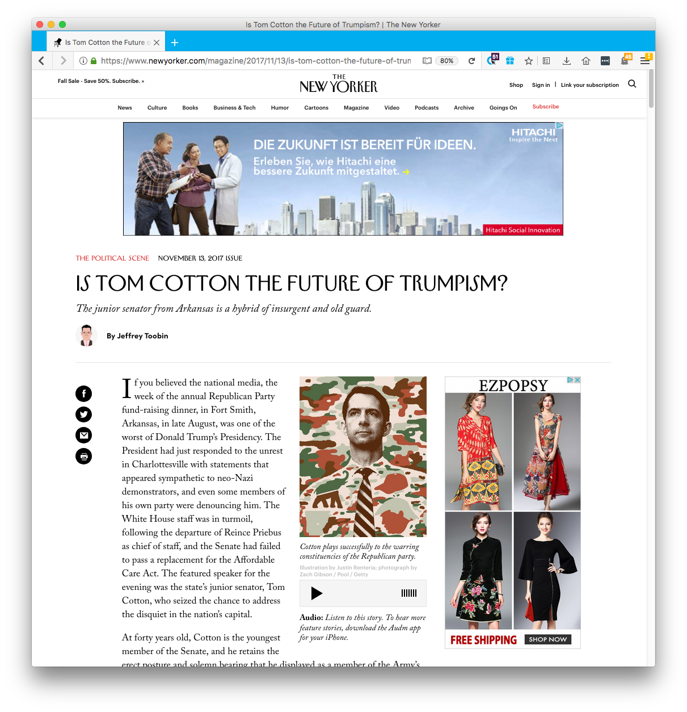
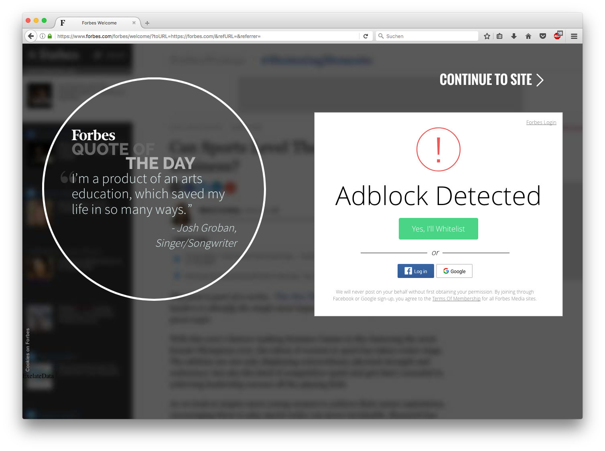

title: The Impact of Tracking on User Experience
subtitle: Beyond privacy - a survey of hidden and visible effects of tracking on user experience.
author: privacy team
type: article
publish: True
date: 2017-11-07
tags: tracker-free, lightweight
header_img: blog/tracking_and_ux/ux_header.png
+++

We all have been in situations in which we felt that the 
Internet knows us too well: When the pair of shoes that we looked 
for suddenly starts to haunt us on almost every single web page. 
The “magic” behind this phenomenon is called tracking and a 
controversial topic due to security and privacy reasons. 
However, tracking is not only relevant from a privacy-related 
perspective as it also affects user experience in many ways. 
While some of the effects are visible and obvious to everyone, 
others are hidden behind the scenes.

## A Positive Side to Tracking?
But before we get started with the actual effects, let’s 
quickly clarify one thing: Trackers are not good or bad per se. 
In fact, trackers are often just a byproduct of innovative 
technologies that were invented to make the user’s life 
easier in the first place.

For example, content delivery networks (CDN) assure a 
speedy delivery of web pages, analytics tools help to 
better understand users to improve page structures, 
hosted fonts allow designers to ensure that fonts 
look as intended, and single sign-ons increase 
convenience while mitigating password fatigue. 
It's the way these technologies are implemented and used 
that may or may not introduce privacy and user experience side-effects.

## The Visible Effects of Tracking

Online ads are a good example of the visible effects of tracking. 
While some users certainly appreciate ads, many find them annoying or creepy. 
This is also reflected by the increasing usage of ad blockers, 
which grew by 30% in 2016 alone [1].

### Distraction
One reason for this annoyance is that ads fight for the users’ 
attention—in particular ads that use aggressive visuals or 
animations (Figure 1). They distract users from the 
actual page content and the task at hand. This seems to 
contradict banner blindness, the phenomenon of having 
learnt to ignore ads. But rather than ignoring ads per se, 
users seem to ignore the content instead, while 
banners still cause distraction [7]. 

Figure 1: banner ads are intrusive and distracting. In this example they are placed right next to the content to get the users’ attention.

### Deception
Another reason for annoyance is the use of native 
advertising: ads that are designed to resemble content 
as much as possible (Figure 2). The main goal is to 
maximize click-through rates on ads, while deliberately 
accepting the risk to mislead users. Although users are 
less likely to notice the presence of native advertising 
compared to traditional banner ads [9], it is more 
difficult for them to distinguish organic content from paid ads. 

Figure 2: native advertising is deceptive as it makes it difficult for users to distinguish organic content from paid ads.

### Page Breakage
Last but not least, ads and tracking increase page loading 
times: users have to wait substantially longer for 
content to appear, which degrades the online user 
experience. The average data usage by trackers 
amounts to more than 6MB per page load [2]. Mozilla researchers 
further found that the average number of reported 
problems with web pages was higher for users without 
tracking protection [3]. These users reported 
more often that web pages felt slow, laggy, or 
unresponsive. This is surprising because tracking 
protection is often the reason for such page breakage.

### Moments of embarrassment
The facets discussed so far all relate to functional 
problems (i.e., web pages do not work, users cannot 
complete their tasks, etc.). However, there is also 
another dimension to the visual effects of tracking: 
social implications. 

In order to deliver the most relevant ads to the user, 
they are often targeted and based on previous online 
behaviours, such as page visits. For example, a 
user would see ads for sneakers on a news page 
after having searched for sneakers on a shopping 
site. While the majority of users are opposed to 
behavioral targeting and are concerned about 
their privacy [4, 10], behavioral targeting can 
affect the user experience in a much more direct 
way, in particular when sharing a computer: Imagine 
an online purchase for your loved one popping up 
on a web page visited by the future gift recipient — surprise ruined. 
Or imagine a friend looking over your shoulder and getting 
a glimpse on an ad about something that you find embarrassing. 

## The Hidden Effects of Tracking
Yet, a large part of tracking takes place behind the scenes of 
the shiny web surface. It's not obvious that users are 
being observed, yet trackers record all their page visits [6]. 
This is not only a privacy problem, it also affects 
the user experience.

### Lack of Transparency
Most users are aware that their searches and interactions 
are recorded when using services like Facebook or Amazon. 
After all, they explicitly registered and logged in. 
Users understand that such services need to know 
certain things to provide their services, for example, 
to show interesting posts or to suggest new friends.

However, a large part of tracking takes place via 
third-party trackers, scripts that are embedded 
on pages around the web or are part of a browser 
add-on without the users' awareness. These scripts 
call home to report on each user's behavior—often 
without having asked for permission. It is not 
transparent to users that their oftentimes personal 
data is shared, with whom it is shared, and where 
it is stored. For example, users were surprised 
to learn that browsing history is used to target ads [10].

### Lack of Control
Even if users knew about the extent of tracking taking place, 
there is still a lack of control. Once the data is out 
on some servers, users do not have the option to audit 
or delete the data stored about them. Current approaches 
for giving control to users are not understood by users [10].

### Transparency and Control are Critical
Why are transparency and control so important? Data collected 
by trackers reveal more about a person than you might 
think. One page visit may not tell who you are, but 
the visit of multiple pages does. Trackers connect 
these visits through unique identifiers. Suddenly the 
virtual self turns into a real person: Profile pictures 
from social networks reveal the visual appearance, 
location sharing exposes home and workplace, and 
shopping behaviour hint at personal preferences. 
All this happens without the awareness of the 
user—the user experience on the surface does not 
reveal the operating network of trackers underneath 
it.

## The UX Challenges
Both visible and hidden effects of trackers on user 
experience are non-trivial to address. Numerous applications 
or add-ons exist to remove ads from web pages or to 
reduce the effects of tracking. Adblock Plus and NoScript 
are two popular examples.

Figure 3: an example of an ad block wall encouraging users to whitelist trackers.

However, removing ads leads, similar to ads in the first place, 
to page breakage. News sites, for example, use adblock 
detection to put up ad block walls, asking users to 
whitelist ads in order to access the content (Figure 3). 
Ad block walls not only degrade the user experience but 
also reduce traffic to the underlying pages: a recent 
survey found that 74% of American adblock users choose 
to leave sites with adblock walls [1]. Another example 
are pages without visible ads, but that use scripts 
for tracking. Blocking all scripts offers protection, 
but makes modern web pages unusable as many features 
rely on scripting.

Overall, tracking is a complex topic. Its technical 
foundation is hard to grasp for most users. Users 
build their mental models about how trackers work 
based on their own experiences. This leads to wrong 
beliefs, such as Facebook cannot track users as 
soon as they are logged out of the platform. On the 
other hand, advertising is often the only revenue 
stream for web sites. Users benefit from it as 
websites can run without charging their users. 

Nonetheless, revenue should never come at the cost of the users’ 
privacy. It is not easy, but targeted advertising does not 
have to rely on tracking [5]. Users should always be in 
control over their data. This is the paradigm that Cliqz 
follows in their products [11]. The challenges, from a user 
experience point of view, lie in educating users in a simple 
enough way so that they understand the effects of tracking 
and in allowing users to decide which data they want to 
share or not to share. We love to hear your thoughts on this topic.

##References

[1] [2017 Adblock Report](https://pagefair.com/blog/2017/adblockreport/)  
[2] [Trackers Rank](/trackers.html)  
[3] [Privacy Settings Breakage Study](https://docs.google.com/presentation/d/1OVtXAnyeBLX2N1yyZoTMP9AV_6HnI3mnXwIFlOL7yOA/edit)  
[4] [Americans Reject Tailored Advertising and Three Activities That Enable It](http://repository.upenn.edu/cgi/viewcontent.cgi?article=1138&context=asc_papers)  
[5] [Adnostic: Privacy Preserving Targeted Advertising](http://www.nyu.edu/pages/projects/nissenbaum/papers/adnostic.pdf)   
[6] [Tracking the Trackers](https://static.cliqz.com/wp-content/uploads/2016/07/Cliqz-Studie-Tracking-the-Trackers.pdf)  
[7] [Banner ads hinder visual search and are forgotten](https://dl.acm.org/citation.cfm?id=986008)  
[8] [A Review of Online Advertising Effects on the User Experience](https://pdfs.semanticscholar.org/54b4/c030742848f26bd69910d678da6a713a9d5e.pdf)  
[9] [Native Advertising and Digital Natives: The Effects of Age and Advertisement Format on News Website Credibility Judgments](http://www.academia.edu/download/37165600/ISOJ_Journal_V4_N1_2014_Spring.pdf#page=79)  
[10] [Smart, Useful, Scary, Creepy: Perceptions of Online Behavioral Advertising](https://pdfs.semanticscholar.org/db4c/502bafef23e7d8b1de60d628c952a4780acc.pdf)  
[11] [MyOffrz](https://myoffrz.com/fuer-nutzer/)
