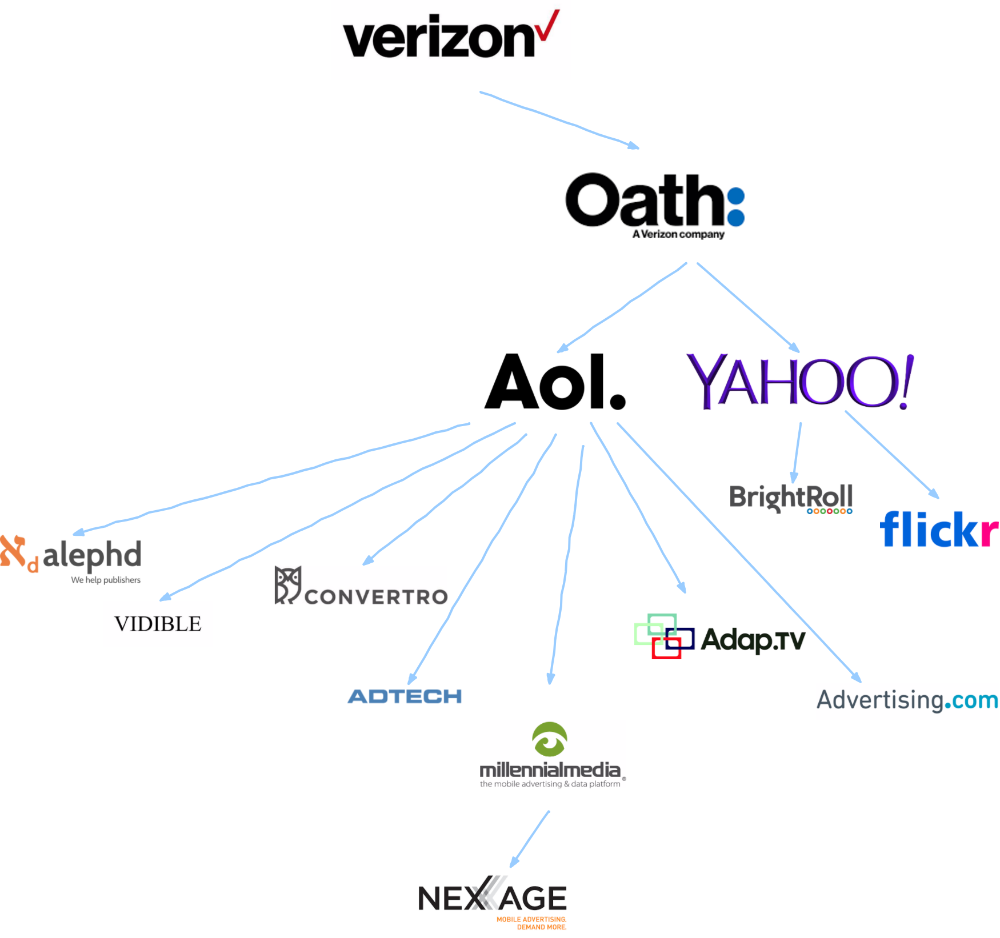

title: February Update - The Tracking Shell Game
subtitle: How mergers and acquisitions are hiding who actually is tracking us.
author: privacy team
type: article
publish: True
date: 2018-02-06
tags: blog, update
header_img: blog/blog-data-feb18-2.png
+++

_This post is one of our regular monthly blogs accompanying an update to the data displayed on WhoTracks.Me. In these posts we introduce what data has been added as well as point out interesting trends and case-studies we found in the last month. Previous month's posts can be found here: [January 2018](./update_jan_2018.html), [December 2017](./update_dec_2017.html)._

We've updated the site today with data collected during January 2018. Due to increased distribution, we have over 115 million page loads this month, an increase of 15% over previous months (see [Where does the data come from?](./where_is_the_data_from.html) for more background on our data collection). The regions from which we are getting data is also diversifying. While 70% of the data still comes from German users, we now have more significant US and international data. We plan to have sufficient data in the coming months in order to provide region-specific tracking breakdowns.

## The tracking shell game

Picking out some of the biggest movers in the rankings this month, we first find [Nexage](../trackers/nexage.html) down 262 places this month, and to one tenth of its reach in May last year. This is probably simply a winding down of the operation which was acquired by Millennial Media in 2014, who were acquired by AOL in 2015, who were acquired by Verizon also in 2015. Their landing page now redirects to [One by AOL](https://www.onebyaol.com/).

One of the challenges for us on whotracks.me is to make the link between tracker domain names, tracking products, and tracking companies. Nexage is an example of how many trackers lead you down a 'rabbit hole' of mergers and acquisitions until you find the company above it all. If we expand out the web of companies underneath Verizon who are also present on whotracks.me, we find 10 different trackers which can be linked: [Adap.tv](../trackers/adap.tv.html), [ADTECH](../trackers/adtech.html), [Advertising.com](../trackers/advertising.com.html), [alephD](../trackers/alephd.com.html), [Convertro](../trackers/convertro.html), [Nexage](../trackers/nexage.html) and [Vidible](../trackers/vidible.html) under AOL, and [Brightroll](../trackers/brightroll.html) and [Flickr](../trackers/flickr_badge.html) under [Yahoo](../trackers/yahoo.html). Furthermore, Yahoo and AOL both have popular web portals ([yahoo.com](../websites/yahoo.com.html), [aol.com](../websites/aol.com.html) and [aol.de](../websites/aol.de.html)) to drive more traffic which they can track. This leads Verizon to be able to track at least 6% of web traffic, the 11th highest reach of any company in our dataset. You can now check the full list of companies sorted by their trackers' combined reach [here](../companies/reach-chart.html).

Verizon's trackers - &copy; WhoTracks.Me 2018

A new entry at 546, [Smarter Travel Media](../trackers/smarter_travel.html) is another example of a smaller company with giants hiding behind it. The tracker is primarly present on tripadvisor and other travel sites, and infact they are a [Tripadvisor](../trackers/tripadvisor.html) company. Tripadvisor in turn is owned by [Expedia](../trackers/expedia.html). Above all of this stands [InterActiveCorp (IAC)](http://iac.com/) who own several other web brands, including [Vimeo](../trackers/vimeo.html) and [Mindspark](../trackers/mindspark.html).

IAC - &copy; WhoTracks.Me 2018

The final movers we would like to highlight this month are [davebestdeals.com](../trackers/davebestdeals.com.html) and [eshopcomp.com](../trackers/eshopcomp.com.html), up 201 and 194 places respectively. Unfortunately we cannot yet trace the owners of these trackers---they are both registered with PrivacyGuard in [Panama](https://who.is/whois/eshopcomp.com) and have no visible landing page. In fact they are likely operated by the same entity as their domains point to the same CloudFront endpoints, for example on the `istatic` subdomain for both domains.

The reason for the lack of transparency in this case is that they are malware. Looking at their profile pages we can see that they have a small presence across many sites, including sites which we know for certain would not have trackers like this in the page (e.g. Google sites, which will only ever contain Google's own trackers). These are likely browser extensions which include code to inject their tracking code in all of the pages the user visits, and send this information back to their servers. The user browsing history which they collect can then by sold on. The Web Of Trust extension was [caught doing this](https://www.forbes.com/sites/leemathews/2016/11/07/web-of-trust-browser-add-on-blasted-for-breaking-user-trust/#5029a0a53ef5) in 2015, and our data shows that it is still a common practice (look for the 'Extensions' tracker category on this site).

This style of user history harvesting also has the advantage that it is not blocked by the majority of Ad-blocking and privacy tools. These domains are not on these blocklists, because the list maintainers will not encounter them - unless they happen to install the malware themselves. Therefore, currently only Cliqz and Ghostery 8's AI anti-tracking are detecting these trackers and preventing them from gathering user sessions - because they are using the same data to find trackers that whotracks.me uses.

## New data points

This month we add data about the content-types loaded by trackers. This is based on values reported by the [webRequest 'type' property](https://developer.mozilla.org/en-US/Add-ons/WebExtensions/API/webRequest/ResourceType). By reporting these values we can further characterise tracker behaviours, and quantify risks, such as which trackers are being permitted to load scripts on certain pages.

We add the following new columns for trackers, reported as the proportion of pages where the specific tracker or company loaded particular resource type(s) into the page:

 * `script`: Javascript code (via a `<script>` tag or web worker).
 * `iframe`: A subdocument (via `<frame>` or `<iframe>` elements).
 * `beacon`: Requests sent through the [Beacon API](https://developer.mozilla.org/en-US/docs/Web/API/Beacon_API).
 * `image`: Image and imageset resources.
 * `stylesheet`: [CSS](https://developer.mozilla.org/en-US/docs/Web/CSS) files.
 * `font`: Custom fonts.
 * `xhr`: Requests made from scripts via the [XMLHttpRequest](https://developer.mozilla.org/en-US/docs/Web/API/XMLHttpRequest) or [fetch](https://developer.mozilla.org/en-US/docs/Web/API/Fetch_API) APIs.
 * `plugin`: Requests of `object` or `object_subrequest` types, which are typically associated with browser plugins such as Flash.
 * `media`: Requests loaded via `<video>` or `<audio>` HTML elements.

With this data we can see that, for example, [Google Analytics](../trackers/google_analytics.html) loads their script on each page load (98% of the time), then registers the visit via a pixel on 59% of page loads. We also see that on 6% of pages a request is also made via the Beacon API.

Similarly, if we look at the [Webtrekk](../trackers/webtrekk.html) tracker, which is present on many popular German websites, we can see that on sensitive websites such as banking ([dkb.de](../websites/dkb.de.html)) and health insurance ([tk.de](../websites/tk.de.html)), the tracker is loaded without scripts. This is at least an indication that in certain contexts website owners are taking care to minimise the potential risk of a third-party being compromised and gathering sensitive information from the page, or even [collecting sensitive information by mistake](https://mixpanel.com/blog/2018/02/05/update-autotrack-data-collection/).

As with [previous additions](./update_dec_2017.html) to the dataset, we don't yet have these fields visualised on the site, but will be working this in the coming months. In the meantime, the [raw data](https://github.com/cliqz-oss/whotracks.me/tree/master/whotracksme/data) is available for you to explore yourself.
