title: June Update - Do you consent?
subtitle: Consent as a service
author: privacy team
type: article
publish: True
date: 2018-06-07
tags: blog, update
header_img: blog/update_jun18/release.png
+++

_This post is one of our regular monthly blogs accompanying an update to the data
displayed on WhoTracks.Me. In these posts we introduce what data has been added as well
as point out interesting trends and case-studies we found in the last month. Previous
month's posts can be found here: [May 2018](./update_may_2018.html), [April 2018](./update_apr_2018.html)._

We have updated the site again this month with tracker data from 370 million page loads during May
2018. We've expanded the number of trackers shown further to over 1000, and we now show information
for the top 1750 websites. We also have published regional versions of the data for the US, France
Germany, allowing regional disparities to be investigated.

As we mentioned [last month](./update_may_2018.html), the [GDPR](https://en.wikipedia.org/wiki/General_Data_Protection_Regulation)
has now come into effect, which is expected to have an effect on how the data collected via online
tracking is handled. So far, the main observation is that sites have deployed complex consent
dialogs, trying to get users to consent to being tracked on their sites. We note the rise this
month of vendors providing these consent dialogs.

Despite the changes in regulation, we see no evidence of a reduction in the number of third parties
loaded on websites this month (also when doing a week-by-week analysis). The average number of
third-parties loaded on popular websites remained at 8.5, which is the same as in April.

## Consent as a service

One observable result of the GDPR is a rise in the user of Consent Management Platforms (CMPs) by
websites. These services manage the cookie consent notices shown on sites. Now that GDPR is in
place, users should be informed of all services collecting data on the site, and be allowed to
opt-out of certain practices and data collection. This means that these CMPs have become much more
prominent, providing deeper controls, and propegating user consent to the third-party services.

The WhoTracks.Me data has tracked the rise of several CMPs appearing this month, as well as
existing providers increasing their presence. With our data we can detect where they are present
and then compare their approaches to asking for user consent, and we present a short survey of
these here:

### TrustArc

[TrustArc](https://www.trustarc.com/) (formally TRUSTe) have been providing cookie consent dialogs
since the original ePrivacy regulation introduce the concept. [Our data shows](../trackers/truste_consent.html)
that their reach has doubled in recent months as they have obviously gained customers using their
services for GDPR compliance.

Their familiar consent popup now has improved opt-out capabilities. These are however hidden behind
a 'More Information' link. This popup has not changed from the pre-GDPR options, so users may not
realise that improved opt-out options are hidden behind this button. The styling of the button as
a link also does not suggest that consent can be configured.

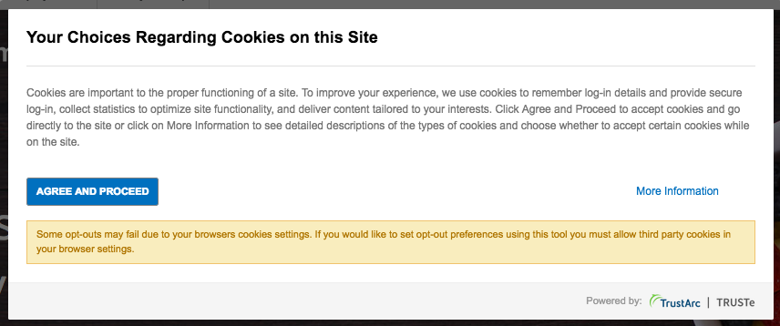

TrustArc: Consent popup.

The 'More Information' button leads to a screen where consent can be specified for different cookie
types. On the tested site ([MyFitnessPal.com](../websites/myfitnesspal.com.html)) this view had
all types enabled by default.

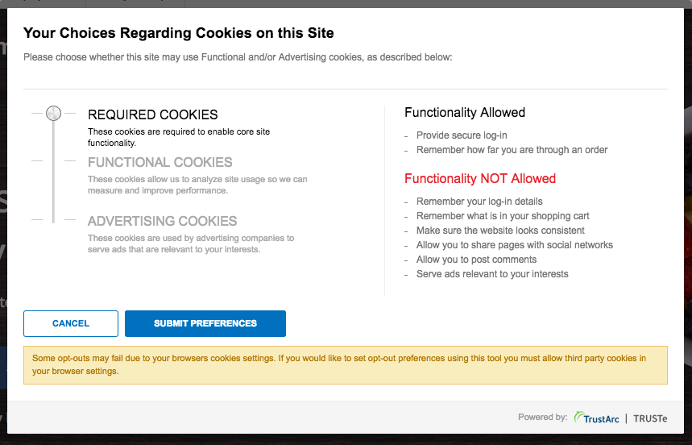

TrustArc: Choosing consent settings.

After submitting, we hit a processing dialog. In our testing this processing takes minutes to complete,
and blocks access to the underlying page until it completes. This poor user-experience is may
reduce the amount of users who will actually take the time to express consent settings. After
waiting minutes once, they may subsequently simply agree to all, or just abandon sites who present
this dialog.

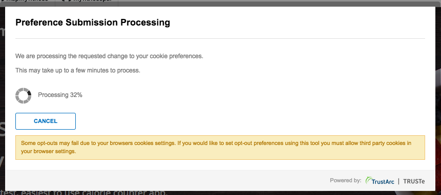

TrustArc: Processing......

Another manifestation of the TrustArc CMP, found on [Weather Underground](../websites/wunderground.com.html)
provides a more detailed popup, including details of the third-parties in each category. This
version, however, also suffers from a long processing time for the settings.

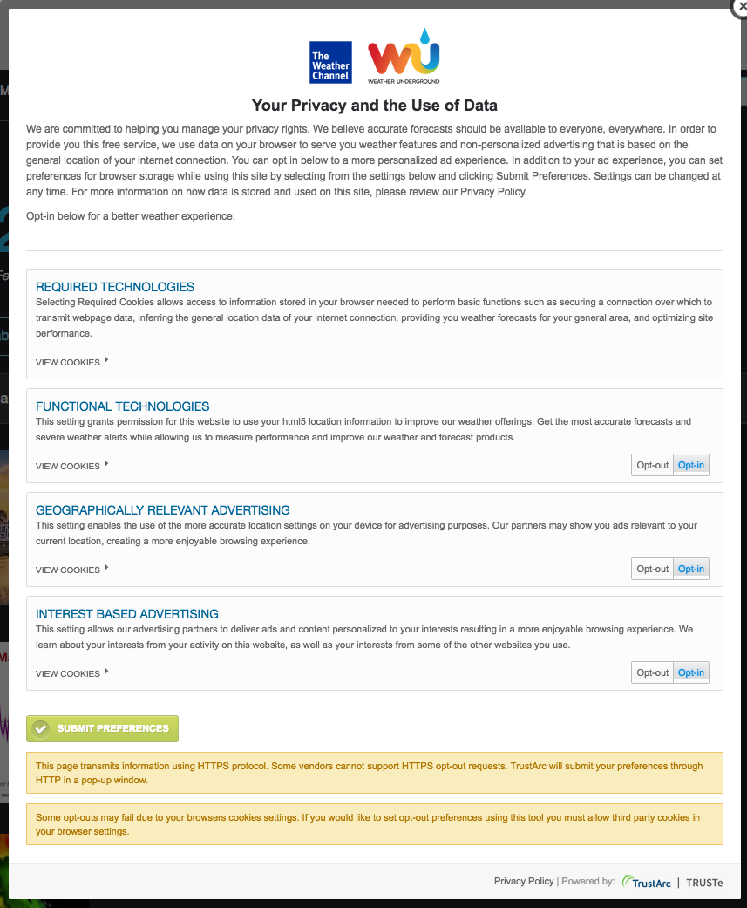

TrustArc: Detailed view

### IAB Consent Framework

In response to the GDPR, the [IAB](https://iabtechlab.com/) proposed a framework for propegating
user consent through ad-networks. The [GDPR Transparency and Consent Framework](https://iabtechlab.com/standards/gdpr-transparency-and-consent-framework/)
aims to create a standardised expression of consent which can be passed around ad networks.

In this framework, CMPs are [registered](http://advertisingconsent.eu/iab-europe-transparency-consent-framework-list-of-registered-cmps/)
and a first party cookie specifies which CMP obtained the consent on this site, and which
purposes and vendors are permitted. The CMP code and vendor list are served from a single domain,
`consensu.org`, which means we can [measure the usage](../trackers/iab_consent.html) of this
framework.

An example of this framework can be seen on [SourceForge](../websites/sourceforge.net.html). In
this case, [Quantserve](../trackers/quantcast.html) acts as the CMP to set the IAB consent cookie.
Note this framework allows first-party and third-party consents to be specified separately for a
standardised set of purposes.

  

    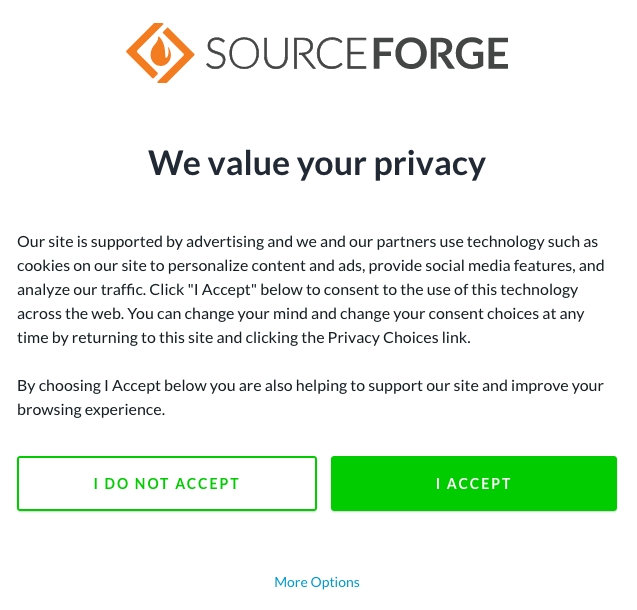
  

  

    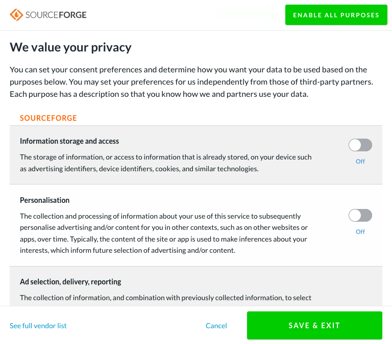
  

Quantserve consent dialog, using the IAB framework

Unlike the TrustArc consent, opting out in this dialog is instant. Furthermore, in testing, all
options were disabled by default, and a blanket opt out is also made easy.

### Cookiebot

A new service which appeared in our data this month is [Cookiebot](../trackers/cookiebot.html).
They provide a very simple clean dialog to allow quick specification of consent.

One site using this service is [Gitlab](../websites/gitlab.com.html). We note here that all options
are selected by default, and consent is assumed even if the user does not click 'OK'.

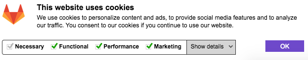

Cookiebot dialog on gitlab.com.

The 'Show details' button provides more detailed information about which providers and cookies
fall under each category.

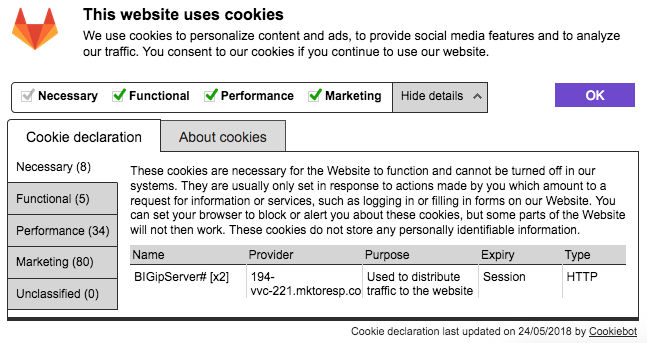

Cookiebot detailed view.

In this case the opt-out is also instant.

### OneTrust

Lastly, [OneTrust](https://www.onetrust.com/). This service does not appear in the WhoTracks.Me
data this month, as its reach is low and it does not employ tracking technologies. However, we
can still see its presence on some sites.

One feature of this CMP seems to be its configurability. We find multiple different levels of
options available on different sites. Firstly, the cookie banner, shown on the bottom of the
page, may provide configurability via a 'More Information' button. For example on
[CNN](../websites/cnn.com.html):

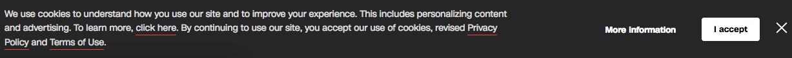

OneTrust banner on CNN

However, we also found examples where one can only accept, for example on [express.de](../websites/express.de.html):

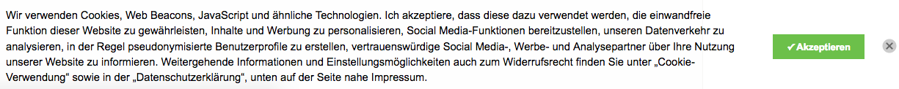

OneTrust banner on express.de

Secondly, the information dialog may or may not allow the user to opt-out. We can compare the
dialogs on [cnn.com](../websites/cnn.com.html) and [mailchimp.com](../websites/mailchimp.com.html):

  

    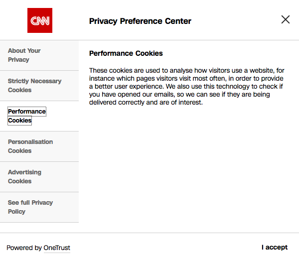
  

  

    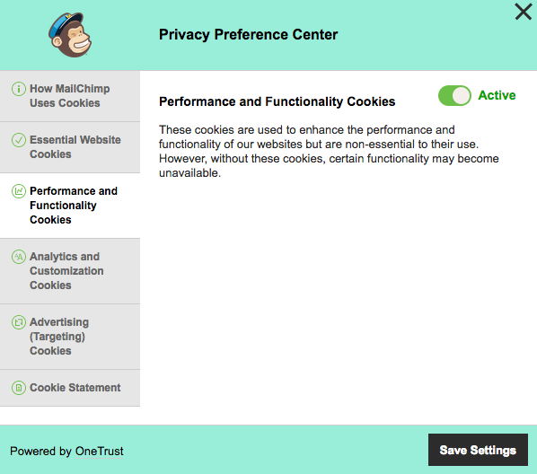
  

OneTrust Preference Center on cnn.com and mailchimp.com

Again, opt-out (when available) is instant.

### Conclusion

Since GDPR came into force we have seen a marked increase in cookie consent, many of which block
access to the page until consent is obtained. These CMPs aim to standardise the process, making it
easier for users to quickly express their preferences. However, as we have seen in this article,
the current main CMPs differ radically in their approach to the problem.

As publishers main aim from deploying a CMP is to achieve maximum opt-in, while remaining compliant
with the law, there is a strong incentive for platforms to decieve users into consenting. Examples
such as TrustArc show some dark patterns which nudge users to accepting all. Platforms which
provide clear opt-outs, and leave options unticked by default may suffer for providing a better
user experience.

The importance of consent for publishers who rely on advertising revenue, and their willingness to
test users' goodwill in order to obtaining can be seen from this dialog, seen when visiting [GHacks](https://www.ghacks.net/)
having opted out of data collection.

Dialog on seen ghacks.net.

The openness of the IAB Framework is welcome, as it opens up the possibility for standardised
browser interfaces for consent. This would take control of the consent UX out of the hands of site
owners, who will be incentised to 'cheat', and make it neutral and consistent.

