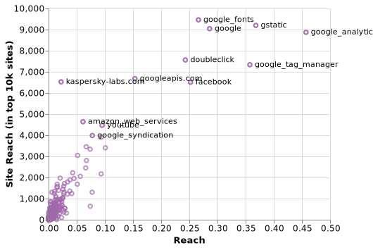

title: Updating our tracking prevalence metrics
subtitle: Making metrics that make more sense.
author: privacy team
type: article
publish: True
date: 2019-02-22
tags: blog, update
header_img: blog/updating-prevalence-metrics/header.jpg
+++

This month we updated the site with data from over 800 million page loads during January. In this
data release we have also made a change to one of the main figures that we publish - `site reach`.
Metrics are as good as their ability to capture a simplified version of reality. The
main motivation for redefining `site reach` attempts to achieve exactly that - simplify the
understanding of prevalence.

The site reach stat was conceived as a measure of how many different sites a tracker has some
presence. In contrast to `reach` - the proportion of pages loading a tracker - it shows how spread
around the web a tracker is.

We define a new site reach metric as:
> The number of sites in the top 10,000 which have this tracker on more than 1% of page loads.

The relationship between reach and site reach paints an interesting picture of prevalence:

Figure 1: Reach vs Site Reach, Jan 2019 (source: whotracks.me)

- High reach and high site reach - Ubiquitous presence across both popular and less popular sites;
A common example of that would be [Google Analytics](../trackers/google_analytics.html).
- High reach and low site reach - Present primarily on few popular, high-traffic sites;
One such example would be [Wikimedia](../trackers/wikimedia.org.html), which is due to
Wikipedia's popularity is loaded very often (hence high reach), but present on few sites
resulting in a low(er) site reach. Another example, for similar reasons, would be
[Ebay Stats](../trackers/ebay.html),
- Low reach and high site reach - Only appearing rarely on many sites, e.g. only on a small number
of pages for each site; In this category appear extensions that operate as "man in the
middle", such as [Kaspersky Labs](../trackers/kaspersky-labs.com.html).
- Low reach and low site reach - Present on few lower-traffic sites. This includes smaller
trackers.

Up until this point, we have defined site reach as the proportion of sites for which a given
tracker was observed a fixed number of times. Using this formula we have run into two fundemental
issues in practice:

 1. How often should a tracker appear in a site, for it to be counted?

The simplest solution would be to say that one observation is sufficient. So if a
tracker has been seen to be present at least once in a given site, we count it. However,
there is some noise to be expected, which could be introduced by particular
browser configurations, installed extensions or ISP redirects. This could result in
falsely counting extra trackers in a given site.

Thus, having a low threshold makes the metric vulnerable to fluctuations from
changes in data-volume. The end result is that if this threshold is too low then the
metric is unstable, fluctuating when no real-world change has occurred. If this
threshold is too high, then it fails to capture the presence of trackers in particular
low(er)-volume subpages of a given website (e.g. payment pages).

 2. The long-tail of low traffic sites skews the results.

    During January our dataset counted 1.3 million distinct sites. However the traffic distribution is very skewed to the top few thousand
    sites. Looking at the `popularity` metric for sites, which measures the relative amount of traffic
    compared to the most popular site (Google.com), already the 10th most popular site (Pornhub) has
    just 6% of Google's traffic. By the 100th place, this ratio is 0.6%, and 1000th place this is 0.08%.
    By the time we are at the 100,000th entry there are only 430 page loads over a month, and at place
    1,000,000 just 16. This long tail means that, firstly, the impact of tracker presence on these
    sites is low - the bottom 50% of the 1.3 million sites we see only corresponds to 1% of total
    traffic - and secondly, the low data volume increases the noise involved in measuring presence.

Due to these difficulties and the complexities arising when explaining site reach, we
deceded to redefine this metric - making it simpler and more intuitive to the reader, while
still capturing the prevaluence of the tracker.

Given that the top 10,000 sites account for 75% of page loads in our data, we decided to measure
the presence across this fixed set of sites. By fixing the denominator of our formula the output
is no longer influenced by the number of sites observed, which can vary with data volume. This
metric is also simpler - a ratio over 10,000 is easier for most people to understand, than over
1.3 million. For example, we now show a site reach of [13 sites](../trackers/realperson.de.html)
instead of 0.006% previously.

As of now the data is updated to use this new metric, under the `site_reach_top10k` key. A further
 value, `site_avg_frequency` gives the mean presence across these sites.

**How does this metric compare to the previous one?** We back-calculated the new metric for the last
5 months, and found this makes the site reach for some of the top trackers even more concerning:

- [Google Analytics](../trackers/google_analytics.html) went from being present on 70% of all websites to 8,871 of the top 10k, and there are only 539 sites in the top 10k which _don't_ use [Google Fonts](../trackers/google_fonts.html) on any page.
- Of the top 1,000 trackers on WhoTracks.Me, only 47 are on over 1,000 sites, and 331 over 100
sites. This shows just how dominated the tracking landscape by a few trackers monopolising user data.
- The mean site reach for the top 1,000 trackers has been increasing over the last 5 months, from
210 sites last September, to 255 in January.

The new site reach is now present on the WhoTracks.Me website in place of the old metric, and published
in our [data](https://github.com/cliqz-oss/whotracks.me/tree/master/whotracksme/data). As usual we
 will continue publishing monthly updates to track the development of this metric over time.
